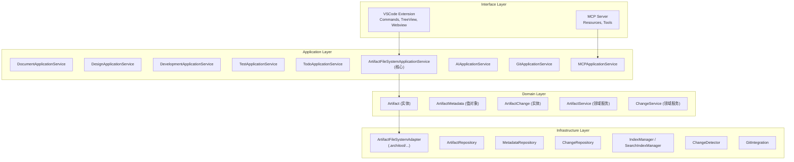

# ArchiTool 期望架构设计

本文档基于 `Architecture.md` 的目标架构和当前项目代码分析，给出期望的架构设计。

---

## 一、架构概览

### 1.1 目标定位

**当前状态**：基于 Dendron 的通用知识管理系统（PKM），正在向架构文档管理工具转型

**目标状态**：面向"架构管理（需求→架构→设计→代码→测试一致性）"的 VSCode 插件 + 内嵌 MCP Server，提供：
- **文档视图**：树形结构浏览和管理所有架构文档（替代现有的 TreeView）
- **视点视图**：从组件角度，查看各个阶段的所有文档（需求、设计、开发、测试）
- **任务视图**：任务管理和协调
- **模板视图**：文档目录划分模板、文档内容模板管理
- 变更追踪（Change 系统）
- AI 辅助（MCP Server）

### 1.2 核心设计原则

1. **DDD 分层架构**：接口层 → 应用层 → 领域层 → 基础设施层
2. **统一 Artifact 模型**：所有视图共享统一的工件抽象
3. **Vault 组织**：保留 Vault 概念，不同内容可在不同 Vault 中管理，支持从 Git 仓库拉取
4. **文件系统存储**：每个 Vault 拥有独立的 `.architool` 目录
5. **MCP 双接口**：VSCode Extension + MCP Server（进程内）
6. **渐进式迁移**：保留现有能力，逐步引入新架构
7. **移除 Workspace**：不再使用 Workspace 概念，直接使用 Vault 集合

---

## 二、架构分层设计

### 2.1 分层结构



### 2.2 与当前项目的映射关系

| 目标架构层 | 新结构位置 | 当前项目对应 | 迁移策略 |
|-----------|----------|------------|---------|
| **Interface Layer** | `apps/extension/src/core/vscode-api/`<br>`apps/webview/src/modules/` | `plugin-core/src/commands/`<br>`plugin-core/src/views/` | 重构为适配器模式，前端模块化 |
| **Application Layer** | `apps/extension/src/modules/*/application/` | `engine-server/src/`<br>`plugin-core/src/services/` | 重构为应用服务，引入 Artifact 抽象 |
| **Domain Layer** | `domain/` | `common-all/src/types/`<br>`NoteProps`, `DVault` | 新增 Artifact 领域模型，保留 Vault 概念，逐步替代 Note |
| **Infrastructure Layer** | `infrastructure/` | `engine-server/src/drivers/`<br>`common-server/src/files.ts` | 新增 `.architool` 适配器，保留文件系统能力 |

---

## 三、核心模块设计

### 3.1 Artifact 模块（核心统一抽象）

**核心设计理念**：Artifact 是架构管理的统一抽象，Vault 中的所有内容都是基于 Artifact 的特化

**特化关系**：
- **Artifact**：核心统一抽象，所有内容的基础
- **ArtifactLink**：基于 Artifact 的关系特化，用于表达工件之间的关系
- **Template**：基于 Artifact 的模板特化，用于创建新工件
- **Viewpoint**：基于 Artifact 的视点特化，用于从不同角度组织工件
- **Task**：基于 Artifact 的任务特化，用于管理工件相关的任务

**视图展示**：不同视图展示不同的特化内容
- **文档视图**：展示所有 Artifact（按 viewType 和 category 组织）
- **视点视图**：展示 Artifact 的视点组织（基于标签、分类等规则）
- **任务视图**：展示 Artifact 相关的任务
- **模板视图**：展示用于创建 Artifact 的模板

#### 3.1.1 领域模型

**Artifact（核心统一抽象）**

Artifact 是架构管理的核心统一抽象，替代原有的 Note 概念。

**核心地位**：
- Artifact 是所有内容的基础抽象
- Vault 中的 artifacts、links、templates、viewpoints、tasks 等都是基于 Artifact 的特化
- 不同视图通过不同的方式展示和操作这些特化内容

**与 NoteProps 的主要差异**：
1. 移除 Note 特有概念：stub, schema, parent/children（层次结构通过路径体现）
2. 简化链接系统：保留 links，移除 anchors（锚点通过路径片段支持）
3. 增强架构属性：viewType, category, relatedCodePaths, relatedComponents
4. 元数据分离：metadata 独立存储，不在 Artifact 中内嵌
5. 内容与元数据分离：body 存储在文件中，metadata 存储在 .metadata.yml

**核心属性**：
- **核心标识**：id（UUID，全局唯一）、vault（所属 Vault）
- **文件属性**：nodeType（FILE/DIRECTORY）、path（相对路径）、name（文件名）、format（文件格式）、contentLocation（完整文件系统路径）
- **分类与视图**：viewType（document/design/development/test）、category（分类）
- **内容属性**：title（标题）、description（描述）、body（内容体，可选）、contentHash（内容哈希）
- **元数据引用**：metadataId（关联的元数据 ID）
- **时间戳**：createdAt、updatedAt（ISO 8601 格式）
- **版本与状态**：version（版本号）、status（draft/review/published/archived）
- **扩展属性**：tags（标签）、custom（自定义属性）

**ArtifactLink（关系特化）**

ArtifactLink 是基于 Artifact 的关系特化，用于表达 Artifact 之间、Artifact 与代码之间关系的显式声明。

**核心属性**：
- **链接标识**：id（链接 ID，UUID）、sourceArtifactId（源 Artifact ID）
- **目标信息**：targetType（artifact/code/file/component/external）、targetId（目标 ID）、targetPath（目标路径）、targetUrl（目标 URL）
- **关系类型**：linkType（implements/references/depends_on/related_to/validates/tests）
- **关系属性**：description（关系描述）、strength（关系强度：strong/medium/weak）
- **代码位置**：codeLocation（代码位置信息，包含文件路径、行号、列号、代码范围）
- **Vault 信息**：vaultId（所属 Vault ID）
- **时间戳**：createdAt、updatedAt（ISO 8601 格式）

**Vault（内容组织）**

Vault 是内容组织和隔离的逻辑概念。

**核心属性**：
- **标识信息**：id（Vault ID）、name（Vault 名称）
- **描述信息**：description（Vault 描述）
- **Git 集成**：remote（Git 远程仓库，可选）、selfContained（是否自包含）
- **配置位置**：配置存储在 `.architool/{vault-name}/architool.yml` 文件中

**RemoteEndpoint（远程仓库）**

**核心属性**：
- url（Git 仓库 URL）
- branch（分支名称，默认：main/master）
- sync（同步策略：auto/manual）

**ArtifactMetadata（元数据）**

ArtifactMetadata 存储 Artifact 的扩展元数据，与 Artifact 分离存储，便于独立管理和查询。

**设计原则**：
- 所有关系信息统一在 ArtifactMetadata 中管理
- 包括文档内链接、显式关系、代码关联等

**核心属性**：
- **标识信息**：id（元数据 ID）、artifactId（关联的 Artifact ID）、vaultId（所属 Vault ID）、vaultName（所属 Vault 名称）
- **类型与分类**：type（类型）、category（分类）
- **标签**：tags（标签数组，用于视点视图和搜索）
- **文档内链接**：links（ArtifactLinkInfo 数组，文档内的链接：wikilinks, refs, external）
- **显式关联关系**：relatedArtifacts（关联的 Artifact ID 列表）、relatedCodePaths（关联的代码路径）、relatedComponents（架构组件 ID 列表）
- **作者与权限**：author（作者）、owner（所有者）、reviewers（评审者列表）
- **扩展属性**：properties（扩展属性，JSON 格式）
- **时间戳**：createdAt、updatedAt（ISO 8601 格式）

**ArtifactLinkInfo（链接信息）**

存储在 ArtifactMetadata 中的链接信息。

**核心属性**：
- type（链接类型：wikilink/ref/external）
- target（目标路径或 ID）
- alias（链接别名，可选）
- position（链接位置，可选，包含行号和列号）

**ArtifactChange（变更记录）**

**核心属性**：
- changeId（变更 ID）
- artifactId（Artifact ID）
- changeType（变更类型：CREATE/UPDATE/DELETE/RENAME/MOVE）
- description（变更描述）
- diffSummary（变更摘要）
- author（作者）
- timestamp（时间戳，ISO 8601 格式）
- impactedArtifacts（受影响的 Artifact ID 列表）
- gitCommitHash（关联的 Git commit）

#### 3.1.1.1 TypeScript 类型定义

**完整的领域模型类型定义**（详见 `DETAILED_TECHNICAL_DESIGN.md` 附录 A）：

```typescript
// 基础类型
export type ArtifactViewType = 'document' | 'design' | 'development' | 'test';
export type ArtifactStatus = 'draft' | 'review' | 'published' | 'archived';
export type ArtifactNodeType = 'FILE' | 'DIRECTORY';
export type LinkType = 'implements' | 'references' | 'depends_on' | 'related_to' | 'validates' | 'tests';
export type LinkStrength = 'strong' | 'medium' | 'weak';
export type TargetType = 'artifact' | 'code' | 'file' | 'component' | 'external';
export type ChangeType = 'CREATE' | 'UPDATE' | 'DELETE' | 'RENAME' | 'MOVE';

// Artifact 核心实体
export interface Artifact {
  id: string; // UUID
  vault: VaultReference;
  nodeType: ArtifactNodeType;
  path: string; // 相对路径
  name: string; // 文件名
  format: string; // 文件格式
  contentLocation: string; // 完整文件系统路径
  viewType: ArtifactViewType;
  category?: string;
  title: string;
  description?: string;
  body?: string; // 可选
  contentHash?: string;
  metadataId?: string;
  createdAt: string; // ISO 8601
  updatedAt: string; // ISO 8601
  version?: string;
  status: ArtifactStatus;
  tags?: string[];
  custom?: Record<string, any>;
}

// Vault 引用
export interface VaultReference {
  id: string;
  name: string;
}

// ArtifactMetadata 值对象
export interface ArtifactMetadata {
  id: string;
  artifactId: string;
  vaultId: string;
  vaultName: string;
  type?: string;
  category?: string;
  tags?: string[];
  links?: ArtifactLinkInfo[];
  relatedArtifacts?: string[];
  relatedCodePaths?: string[];
  relatedComponents?: string[];
  author?: string;
  owner?: string;
  reviewers?: string[];
  properties?: Record<string, any>;
  createdAt: string;
  updatedAt: string;
}

// ArtifactLinkInfo
export interface ArtifactLinkInfo {
  type: 'wikilink' | 'ref' | 'external';
  target: string;
  alias?: string;
  position?: {
    line: number;
    column: number;
  };
}

// ArtifactLink 实体
export interface ArtifactLink {
  id: string;
  sourceArtifactId: string;
  targetType: TargetType;
  targetId?: string;
  targetPath?: string;
  targetUrl?: string;
  linkType: LinkType;
  description?: string;
  strength?: LinkStrength;
  codeLocation?: CodeLocation;
  vaultId: string;
  createdAt: string;
  updatedAt: string;
}

// CodeLocation
export interface CodeLocation {
  file: string;
  line: number;
  column: number;
  range?: {
    start: { line: number; column: number };
    end: { line: number; column: number };
  };
}

// Vault 实体
export interface Vault {
  id: string;
  name: string;
  description?: string;
  remote?: RemoteEndpoint;
  selfContained: boolean;
  readOnly: boolean; // Git Vault 为 true
}

// RemoteEndpoint
export interface RemoteEndpoint {
  url: string;
  branch: string; // 默认：main/master
  sync: 'auto' | 'manual';
}

// ArtifactChange 实体
export interface ArtifactChange {
  changeId: string;
  artifactId: string;
  changeType: ChangeType;
  description?: string;
  diffSummary?: string;
  author?: string;
  timestamp: string;
  impactedArtifacts?: string[];
  gitCommitHash?: string;
}
```

**说明**：完整的类型定义、工具类型、验证函数等详见 `DETAILED_TECHNICAL_DESIGN.md` 附录 A。

#### 3.1.2 应用服务

**ArtifactFileSystemApplicationService（Artifact 文件系统应用服务）**

提供 Artifact 的创建、删除、更新、移动、查询等核心功能：

```typescript
export interface ArtifactFileSystemApplicationService {
  /**
   * 创建 Artifact
   * @throws ArtifactError 如果 Vault 为只读、路径已存在、输入无效等
   */
  createArtifact(opts: {
    vault: VaultReference;
    viewType: ArtifactViewType;
    category?: string;
    path: string;
    title: string;
    content?: string;
    format?: string;
    tags?: string[];
  }): Promise<Result<Artifact, ArtifactError>>;

  /**
   * 删除 Artifact
   * @throws ArtifactError 如果 Artifact 不存在、Vault 为只读等
   */
  deleteArtifact(artifactId: string): Promise<Result<void, ArtifactError>>;

  /**
   * 更新 Artifact 内容
   * @throws ArtifactError 如果 Artifact 不存在、Vault 为只读等
   */
  updateArtifact(
    artifactId: string,
    updates: Partial<Pick<Artifact, 'title' | 'description' | 'body' | 'tags' | 'status'>>
  ): Promise<Result<Artifact, ArtifactError>>;

  /**
   * 移动/重命名 Artifact
   * @throws ArtifactError 如果源不存在、目标已存在、Vault 为只读等
   */
  moveArtifact(
    artifactId: string,
    newPath: string
  ): Promise<Result<Artifact, ArtifactError>>;

  /**
   * 获取 Artifact 列表
   */
  listArtifacts(opts?: {
    vaultId?: string;
    viewType?: ArtifactViewType;
    category?: string;
    limit?: number;
  }): Promise<Result<Artifact[], ArtifactError>>;

  /**
   * 获取 Artifact 详情
   */
  getArtifact(artifactId: string): Promise<Result<Artifact, ArtifactError>>;

  /**
   * 获取 Artifact 元数据
   */
  getMetadata(artifactId: string): Promise<Result<ArtifactMetadata, ArtifactError>>;

  /**
   * 更新 Artifact 元数据
   */
  updateMetadata(
    artifactId: string,
    updates: Partial<ArtifactMetadata>
  ): Promise<Result<ArtifactMetadata, ArtifactError>>;
}
```

**VaultApplicationService（Vault 应用服务）**

提供 Vault 的管理功能：

```typescript
export interface VaultApplicationService {
  /**
   * 添加本地 Vault
   * @throws VaultError 如果 Vault 名称已存在、路径无效等
   */
  addLocalVault(opts: {
    name: string;
    description?: string;
    selfContained?: boolean;
  }): Promise<Result<Vault, VaultError>>;

  /**
   * 从 Git 仓库添加 Vault（只读模式）
   * @throws VaultError 如果 Git 仓库不存在、克隆失败等
   */
  addVaultFromGit(opts: {
    name: string;
    remote: RemoteEndpoint;
    description?: string;
  }): Promise<Result<Vault, VaultError>>;

  /**
   * 复制 Git Vault 为本地 Vault（用于修改）
   * @throws VaultError 如果源 Vault 不存在、不是 Git Vault 等
   */
  forkVault(
    sourceVaultId: string,
    newVaultName: string
  ): Promise<Result<Vault, VaultError>>;

  /**
   * 移除 Vault
   * @throws VaultError 如果 Vault 不存在
   */
  removeVault(vaultId: string, opts?: {
    deleteFiles?: boolean; // 是否删除本地文件
  }): Promise<Result<void, VaultError>>;

  /**
   * 同步 Vault（从 Git 拉取更新，仅适用于 Git Vault）
   * @throws VaultError 如果 Vault 不是 Git Vault、同步失败等
   */
  syncVault(vaultId: string): Promise<Result<void, VaultError>>;

  /**
   * 获取所有 Vault
   */
  listVaults(): Promise<Result<Vault[], VaultError>>;

  /**
   * 获取指定 Vault
   */
  getVault(vaultId: string): Promise<Result<Vault, VaultError>>;
}
```

**说明**：完整的应用服务接口定义、Result 类型、错误类型等详见 `DETAILED_TECHNICAL_DESIGN.md` 附录 B。

#### 3.1.3 基础设施适配器

**ArtifactFileSystemAdapter（Artifact 文件系统适配器）**

提供文件系统级别的 Artifact 操作：

- **getArtifactRoot**：获取统一的 `.architool` 根目录路径（工作区根目录或用户指定位置）
- **getVaultPath**：获取 Vault 在 `.architool` 下的存储路径（`.architool/{vault.name}`）
- **readArtifact**：读取 Artifact 内容
- **writeArtifact**：写入 Artifact 内容（原子操作）
- **readMetadata**：读取元数据（从 YAML 文件或 DuckDB）
- **writeMetadata**：写入元数据（到 YAML 文件，并同步到 DuckDB 索引）
- **queryMetadata**：批量查询元数据（从 DuckDB 运行时索引查询，然后读取 YAML 文件）
- **createLink**：创建 ArtifactLink（写入 YAML 文件，并同步到 DuckDB 索引）
- **readLink**：读取 ArtifactLink（从 YAML 文件）
- **queryLinks**：查询 ArtifactLink（从 DuckDB 运行时索引查询，然后读取 YAML 文件）
- **deleteLink**：删除 ArtifactLink（删除 YAML 文件，并同步到 DuckDB 索引）
- **readChanges**：读取变更记录
- **writeChange**：写入变更记录

**YamlMetadataRepository（YAML 元数据存储库）**

提供 YAML 文件级别的元数据操作：

- **getMetadataPath**：获取元数据文件路径（统一存储在 Vault 顶层的 metadata 目录下，扁平化，例如：`metadata/artifact-001.metadata.yml`）
- **readMetadata**：读取元数据（从 YAML 文件）
- **writeMetadata**：写入元数据（到 YAML 文件）
- **deleteMetadata**：删除元数据（删除 YAML 文件）
- **listMetadataFiles**：列出所有元数据文件路径

**DuckDbRuntimeIndex（DuckDB 运行时索引）**

提供 DuckDB 数据库级别的索引和查询功能：

- **initialize**：初始化数据库连接（全局运行时数据库），使用 DuckDbFactory 创建连接，初始化向量搜索，创建表结构
- **createTables**：创建表结构（包括向量搜索索引）
  - `artifact_metadata_index` 表：存储元数据索引
  - `artifact_links_index` 表：存储链接索引
  - 创建必要的索引（artifact_id、vault_id、type、category 等）
- **syncFromYaml**：从 YAML 文件同步到索引（插入或更新），同时更新向量索引
- **removeFromIndex**：从索引中删除（当 YAML 文件删除时）
- **queryIndex**：查询索引（返回文件路径，用于读取 YAML 文件），支持按 vaultId、vaultName、type、category、author 等条件查询
- **vectorSearch**：向量搜索（语义搜索，返回文件路径），使用 VectorSearchUtils 实现
- **batchSyncFromYaml**：批量同步（从 YAML 文件构建索引），用于初始化或重建索引
- **close**：关闭连接

**MetadataQuery（元数据查询）**

查询条件包括：
- vaultId、vaultName（Vault 过滤）
- type、category（类型和分类过滤）
- tags（标签过滤）
- relatedArtifactId、relatedCodePath（关联关系过滤）
- author（作者过滤）
- vectorSearch（向量搜索）
- limit（结果数量限制）

**ArtifactLinkRepository（ArtifactLink 存储库）**

提供 ArtifactLink 的存储和查询功能：

- **create**：创建链接
- **query**：查询链接（支持多种查询条件）
- **delete**：删除链接
- **findByArtifact**：根据 Artifact ID 查询所有相关链接
- **findByCodePath**：根据代码路径查询相关链接

**LinkQuery（链接查询）**

查询条件包括：
- sourceArtifactId（源 Artifact ID）
- targetType（目标类型：artifact/code/file/component/external）
- targetId、targetPath（目标 ID 或路径）
- linkType（链接类型：implements/references/depends_on/related_to/validates/tests）
- vaultId（Vault ID）

### 3.2 视图模块设计

**视图系统架构**：插件提供四个主要视图，视图模块已整合到项目结构中（详见第八章"项目结构设计"）：
- **后端模块**：`apps/extension/src/modules/`（包含各视图的领域层、应用层、基础设施层）
- **前端模块**：`apps/webview/src/modules/`（包含各视图的 UI 组件）

#### 3.2.1 文档视图（Document View）

**定位**：替代现有的 TreeView，树形结构浏览和管理所有架构文档

**展示内容**：展示所有 Artifact（核心统一抽象）

**职责**：
- 以树形结构展示所有 Artifact（按 viewType 和 category 组织）
- 支持展开/折叠节点
- 点击节点快速打开文档
- 显示文档的层级关系（基于路径）
- 支持创建、编辑、删除 Artifact
- 支持 Artifact 搜索和过滤
- 可以显示 Artifact 的链接关系（基于 ArtifactLink）

**视图类型**：
- Native Tree View（VSCode 原生树视图）

**关键服务**：
- `DocumentTreeViewProvider`：树视图数据提供者
- `DocumentApplicationService`：文档应用服务
- `DocumentFileSystemService`：文档文件系统服务

**说明**：
- 展示 Artifact 本身（核心内容）
- 可以关联显示 ArtifactLink（关系信息）

**显示内容**：
```
文档视图
├── 规范知识库
│   ├── 📄 文档 (documents)
│   │   ├── requirements/
│   │   │   ├── user-login.md
│   │   │   └── payment-flow.md
│   │   ├── architecture/
│   │   │   └── system-design.md
│   │   └── standards/
│   │       └── coding-standards.md
│   ├── 🎨 设计 (design)
│   │   ├── diagrams/
│   │   └── mockups/
│   ├── 💻 开发 (development)
│   │   └── code-reviews/
│   └── 🧪 测试 (test)
│       └── test-cases/
└── 本地知识库
    └── ...
```

#### 3.2.2 视点视图（Viewpoint View）

**定位**：以标签为切入点，串联所有打上对应一个或多个标签的文档

**展示内容**：展示基于标签组织的 Artifact（基于 Viewpoint 特化）

**核心概念**：

1. **标签（Tags）** - 视点视图的切入点
   - 文档可以在 frontmatter 中包含 `tags` 字段（推荐使用，非强制）
   - 标签可以是单个字符串或字符串数组
   - 标签是视点视图的切入点，用于串联和组织文档

2. **视点（Viewpoint）**
   - 视点是一组标签的组合规则
   - 每个视点定义了一个特定的文档视图角度
   - 视点可以包含：
     - 必须包含的标签（AND 关系）
     - 可选包含的标签（OR 关系）
     - 排除的标签（NOT 关系）

3. **视点视图（Viewpoint View）**
   - 以标签为切入点，串联所有打上对应一个或多个标签的文档
   - 各个视点展开以树的形式展示
   - 支持多种预定义视点（生命周期、架构层次、需求管理、架构管理等）
   - 支持自定义视点（基于标签组合规则）

**职责**：
- 基于标签筛选和组织 Artifact
- 以树形结构展示匹配视点的所有文档
- 支持自定义视点（基于标签组合规则）
- 支持视点配置管理
- 支持视点展开/折叠

**视图类型**：
- Native Tree View（VSCode 原生树视图）

**关键服务**：
- `ViewpointApplicationService`：视点应用服务
- `ViewpointTreeDataProvider`：视点树视图数据提供者
- `ViewpointManager`：视点管理器
- `ViewpointTreeItem`：视点树项

**预定义视点**：

1. **生命周期视图（lifecycle）**
   - 用途：按研发生产周期组织文档
   - 标签规则：文档需要包含 `lifecycle` 标签（有该标签的文档才会显示）
   - 展示方式：树形结构，按阶段（需求→设计→研发→测试→部署）组织

2. **架构层次视图（architecture）**
   - 用途：按架构层次组织文档
   - 标签规则：文档需要包含 `architecture` 标签（有该标签的文档才会显示）
   - 展示方式：树形结构，基于文件名的层次结构

3. **需求管理视图（requirement）**
   - 用途：聚焦需求相关的文档
   - 标签规则：文档需要包含 `type.requirement` 标签（有该标签的文档才会显示）
   - 展示方式：树形结构

4. **设计管理视图（design）**
   - 用途：聚焦设计相关的文档
   - 标签规则：文档需要包含 `type.design` 标签（有该标签的文档才会显示）
   - 展示方式：树形结构

**视点匹配算法**：
- 没有标签的文档：直接排除，不参与视点匹配
- 需要标签（required）：文档必须包含所有指定标签（AND 关系）
- 可选标签（optional）：文档至少包含一个指定标签（OR 关系）
- 排除标签（excluded）：文档不能包含任何指定标签（NOT 关系）
- **只显示匹配视点的文档：如果文档 A 匹配视点，则显示；如果文档 B 不匹配视点，则不显示**

**说明**：
- Viewpoint 是基于 Artifact 的视点特化，用于从不同角度组织 Artifact
- 视点视图以标签为切入点，串联所有打上对应一个或多个标签的文档
- 各个视点展开以树的形式展示，便于浏览和管理
- **当前状态：** ⏳ 待实施（计划中，参考 VIEWPOINT_VIEW_IMPLEMENTATION_PLAN.md）

**显示内容**：
```
视点视图
├── 预定义视点
│   ├── 生命周期视图 (12)  # 显示匹配的文档数量
│   │   ├── 需求阶段
│   │   │   ├── user-login.md
│   │   │   └── payment-flow.md
│   │   ├── 设计阶段
│   │   │   └── system-design.md
│   │   └── 开发阶段
│   │       └── user-service-review.md
│   ├── 架构层次视图 (8)
│   │   ├── 应用层
│   │   │   └── user-controller.md
│   │   ├── 服务层
│   │   │   └── user-service.md
│   │   └── 数据层
│   │       └── user-repository.md
│   └── 组件视图 (15)
│       ├── 用户管理模块
│       │   ├── 需求文档
│       │   ├── 设计文档
│       │   └── 开发文档
│       └── 支付模块
│           └── ...
└── 自定义视点
    ├── 用户管理模块视图 (6)
    │   ├── user-login.md
    │   ├── user-service.md
    │   └── ...
    └── 支付流程视图 (4)
        ├── payment-flow.md
        └── ...
```

#### 3.2.3 任务视图（Task View）

**定位**：任务管理和协调

**展示内容**：展示 Artifact 相关的任务（基于 Task 特化）

**职责**：
- 显示所有任务
- 支持按分类、状态、优先级过滤
- 支持创建、编辑、删除任务
- 支持任务分配和状态更新
- 支持任务与 Artifact 关联（通过 wikilinks）
- 支持任务提醒和统计
- 支持搜索、分组、排序功能

**视图类型**：
- Native Tree View（VSCode 原生树视图）

**关键服务**：
- `TasksTreeDataProvider`：任务树视图数据提供者（已实现）
- `TaskTreeItem`：任务树项（已实现）
- `IntegrationManager`：外部系统集成管理器（已实现）
- `TaskSyncService`：外部系统任务同步服务（已实现）

**视图功能**：
- **分组**：按状态（Status）、负责人（Owner）、优先级（Priority）分组，或不分组（None）
- **排序**：按优先级（Priority）、截止日期（DueDate）、最后更新（LastUpdated）、标题（Title）排序
- **筛选**：按负责人、状态、优先级筛选
- **搜索**：支持全文搜索
- **关联文档**：支持展开查看任务关联的文档（通过 wikilinks）

**外部系统集成**：
- **集成方式**：适配器模式，支持多种外部系统（Jira、GitHub Issues、Trello 等）
- **同步机制**：轮询同步（默认 10 分钟，最小间隔 60 秒），不使用 Webhook
- **同步方向**：支持双向同步（从外部系统导入和向外部系统导出）
- **冲突解决**：最后更新时间优先，或用户手动选择
- **增量同步**：基于 `updatedSince` 参数，只同步更新的任务

**说明**：
- Task 是基于 Artifact 的任务特化，用于管理 Artifact 相关的任务
- 任务可以关联到多个 Artifact（通过 wikilinks）

**显示内容**：
```
任务视图
├── 开发任务 (development)
│   ├── [ ] 实现用户登录功能
│   ├── [x] 完成支付流程设计
│   └── [ ] 代码审查：UserService.ts
├── 文档任务 (documentation)
│   └── [ ] 更新架构文档
└── 评审任务 (review)
    └── [ ] 评审系统设计文档
```

#### 3.2.4 模板视图（Template View）

**定位**：文档目录划分模板、文档内容模板管理

**展示内容**：展示用于创建 Artifact 的模板（基于 Template 特化）

**职责**：
- 显示所有模板库
- 支持文档目录划分模板（结构模板）
- 支持文档内容模板（内容模板）
- 支持模板预览和编辑
- 支持从模板创建 Artifact（使用模板创建新工件）
- 支持模板分类和管理

**视图类型**：
- Native Tree View 或 Webview（根据需求选择）

**关键服务**：
- `TemplateApplicationService`：模板应用服务
- `TemplateRepository`：模板存储库
- `TemplateProcessor`：模板处理器（预处理、后处理）

**说明**：
- Template 是基于 Artifact 的模板特化，用于创建新 Artifact
- 结构模板定义 Artifact 的目录结构和组织方式
- 内容模板定义 Artifact 的具体内容格式
- 从模板创建 Artifact 时，会生成新的 Artifact 实例

**显示内容**：
```
模板视图
├── DesginTemplate
│   ├── 📁 结构模板 (structure)
│   │   ├── requirement-template.yml
│   │   ├── architecture-template.yml
│   │   └── design-template.yml
│   ├── 📄 内容模板 (content)
│   │   ├── requirements/
│   │   │   └── user-story-template.md
│   │   ├── design/
│   │   │   └── system-design-template.md
│   │   └── architecture/
│   │       └── adr-template.md
│   ├── ⚙️ 处理器 (processors)
│   │   ├── preprocessors/
│   │   └── postprocessors/
│   └── 🔧 函数 (functions)
└── local
    └── ...
```

### 3.3 Vault 管理模块

#### 3.3.1 Vault 概念

**Vault 的作用**：
- **内容根**：Vault 是模板、文档、任务等的根，所有内容都在 Vault 下
- **内容隔离**：不同 Vault 管理不同的内容集合，互不干扰
- **Git 集成**：每个 Vault 可以关联独立的 Git 仓库，支持从远程拉取和同步
- **统一存储**：所有 Vault 的内容都存储在统一的 `.architool` 目录下，按 Vault 名称组织
- **灵活组织**：可以混合使用本地 Vault 和从 Git 拉取的 Vault
- **Vault 级别的共享**：所有内容的共享和同步都以 Vault 为维度进行
- **Vault 隔离**：每个 Vault 拥有独立的存储和索引，互不干扰

**Git Vault 只读规则**：
- **只读限制**：通过 Git clone 下来的 Vault 是只读的，不允许直接修改其内容
- **查看权限**：Git Vault 只允许查看，不允许创建、编辑、删除操作
- **复制后修改**：如果需要修改 Git Vault 的内容，需要先复制（fork）一个新的本地 Vault，然后在新 Vault 中进行修改
- **同步更新**：Git Vault 可以通过 `git pull` 同步远程仓库的最新更改，但本地修改会被覆盖
- **技术实现**：Git Vault 在文件系统层面标记为只读，应用层进行权限校验

#### 3.3.2 Vault 类型

**本地 Vault**：
- 无远程仓库关联
- 可读可写，支持所有操作（创建、编辑、删除）

**Git Vault（从 Git 仓库拉取）**：
- 必须配置远程仓库
- **只读模式**：不允许直接修改内容
- 只允许查看和同步操作
- 如需修改，需要先复制为本地 Vault

#### 3.3.3 Vault 操作流程

1. **添加本地 Vault**
   - 用户指定 Vault 名称和路径
   - 系统在 `.architool/{vault-name}/` 下创建 Vault 目录结构
   - 初始化 Vault 配置（`architool.yml`）
   - 创建必要的目录结构（artifacts、metadata、links、templates、tasks、viewpoints、changes）
   - 支持所有操作（创建、编辑、删除）

2. **从 Git 添加 Vault**
   - 用户提供 Git 仓库 URL
   - 系统在 `.architool/{vault-name}/` 下创建 Vault 目录
   - 使用 GitVaultAdapter 克隆 Git 仓库到 Vault 目录
   - 如果 Git 仓库包含 Vault 内容（artifacts、templates、tasks 等），则同步到对应 Vault 目录
   - 配置远程仓库信息（用于后续同步）
   - **设置为只读模式**：不允许直接修改内容
   - 标记为 Git Vault 类型

3. **同步 Vault**
   - 对于 Git Vault，使用 GitVaultAdapter 执行 `git pull` 拉取最新更改
   - 同步 Vault 下的所有内容（artifacts、templates、tasks、viewpoints 等）
   - 更新索引和缓存（DuckDB）
   - 检测变更并记录到 changes 目录
   - **注意**：同步会覆盖本地任何修改（Git Vault 为只读，不应有本地修改）
   - 支持手动同步和自动同步（可配置）

4. **复制 Git Vault（Fork）**
   - 用户选择 Git Vault 进行复制
   - 系统创建新的本地 Vault，复制 Git Vault 的所有内容
   - 新 Vault 为可写模式，支持所有操作
   - 新 Vault 与原始 Git Vault 独立，互不影响
   - 新 Vault 不再关联原始 Git 仓库

5. **移除 Vault**
   - 从全局配置中移除 Vault 配置
   - 可选：删除本地文件（需用户确认）
   - 清理相关的索引和缓存

### 3.4 MCP 模块设计

#### 3.4.1 MCP Server 启动

**MCPServerStarter（MCP Server 启动器）**

负责启动和管理进程内 MCP Server：

- **start**：启动进程内 MCP Server，注册资源和工具
- **stop**：停止 MCP Server

#### 3.4.2 MCP 资源（Resources）

参考标准知识库 map 的 API，MCP 资源 URI 格式：

- `archi://artifact/{id}` - Artifact 资源（统一抽象，不区分视图类型）
- `archi://vault/{vault-name}` - Vault 资源

#### 3.4.3 MCP 工具（Tools）

参考标准知识库 map 的 API，MCP 工具接口：

- **mcp_knowledge_base_list_entries**：列出知识库条目（参数：vault 名称（可选）、查询条件）→ 返回 Artifact 列表
- **mcp_knowledge_base_get_entry**：获取知识库条目（参数：artifact ID）→ 返回 Artifact 详情
- **mcp_knowledge_base_search**：搜索知识库（参数：搜索关键词、vault 名称（可选）、标签（可选））→ 返回匹配的 Artifact 列表
- **mcp_knowledge_base_create_entry**：创建知识库条目（参数：vault 名称、viewType、category、内容）→ 返回创建的 Artifact
- **mcp_knowledge_base_update_entry**：更新知识库条目（参数：artifact ID、更新内容）→ 返回更新后的 Artifact
- **mcp_knowledge_base_delete_entry**：删除知识库条目（参数：artifact ID）→ 返回删除结果
- **mcp_knowledge_base_list_links**：列出条目链接（参数：artifact ID）→ 返回 ArtifactLink 列表
- **mcp_knowledge_base_create_link**：创建条目链接（参数：源 Artifact ID、目标信息、链接类型）→ 返回创建的 ArtifactLink

---

## 四、存储布局设计

### 4.1 目录结构

**核心原则**：所有文件统一存储在 `.architool` 目录下，不依赖插件运行所在的项目结构

```
workspace-root/                    # VSCode 工作区根目录（任意位置）
│
└── .architool/                    # 统一存储根目录（所有内容都在此）
    ├── architool.yml              # 全局配置（YAML，包含 Vault 列表和全局设置）
    │
    ├── {vault-name-1}/            # Vault 1（按 Vault 名称组织，支持中文）
    │   ├── architool.yml          # Vault 配置（YAML，便于团队共享）
    │   │
    │   ├── artifacts/             # Artifact 存储（核心统一抽象）
    │   │   ├── documents/     # Document 视图（内容文件）
    │   │   │   ├── requirements/
    │   │   │   │   └── user-login.md
    │   │   │   ├── architecture/
    │   │   │   │   └── system-design.md
    │   │   │   └── standards/
    │   │   │       └── coding-standards.md
    │   │   ├── design/        # Design 视图（内容文件）
    │   │   │   ├── diagrams/
    │   │   │   │   └── architecture-diagram.puml
    │   │   │   └── mockups/
    │   │   ├── development/   # Development 视图（内容文件）
    │   │   │   └── code-reviews/
    │   │   │       └── user-service-review.md
    │   │   └── test/          # Test 视图（内容文件）
    │   │       └── test-cases/
    │   │           └── user-login-test.md
    │   │
    │   ├── metadata/          # 元数据索引（artifacts、links、templates 共用，统一存储，扁平化，YAML 格式）
    │   │   ├── {artifactId-1}.metadata.yml
    │   │   ├── {artifactId-2}.metadata.yml
    │   │   └── {artifactId-N}.metadata.yml
    │   │
    │   ├── links/             # ArtifactLink 存储（基于 Artifact 的关系特化，YAML 格式）
    │   │   └── {linkId}.yml
    │   │
    │   ├── templates/         # Template 存储（基于 Artifact 的模板特化，Vault 级别）
    │   │   ├── {template-library-1}/  # 模板库 1
    │   │   │   ├── content/           # 内容模板
    │   │   │   ├── structure/         # 结构模板（YAML）
    │   │   │   ├── processors/        # 模板处理器
    │   │   │   │   ├── preprocessors/
    │   │   │   │   └── postprocessors/
    │   │   │   └── functions/         # 模板变量函数
    │   │   └── {template-library-2}/  # 模板库 2
    │   │
    │   ├── tasks/             # 团队任务（可选，Vault 级别，随 vault 同步）
    │   │   ├── development/           # 开发任务分类
    │   │   │   └── {taskId}.yml       # 任务文件（YAML 格式）
    │   │   ├── documentation/         # 文档任务分类
    │   │   │   └── {taskId}.yml
    │   │   └── review/                # 评审任务分类
    │   │       └── {taskId}.yml
    │   │
    │   ├── viewpoints/        # 视点配置（独立目录，YAML 格式）
    │   │   ├── predefined.yml  # 预定义视点（只读）
    │   │   └── custom.yml      # 自定义视点（YAML，便于团队共享）
    │   │
    │   └── changes/           # 变更记录（Artifact 的变更历史，YAML 格式）
    │       └── {changeId}.yml
    │
    ├── {vault-name-2}/            # Vault 2（从 Git 拉取）
    │   └── ... (相同结构)
    │
    └── cache/                     # 全局运行时缓存（不提交到 Git）
        └── runtime.duckdb         # DuckDB 运行时数据库（向量搜索、运行时数据、统一使用 DuckDB）
```

**说明**：
- **统一存储**：所有内容都在 `.architool/` 目录下，不依赖项目结构
- **Vault 组织**：按 Vault 名称组织，每个 Vault 在 `.architool/{vault-name}/` 下（支持中文名称）
- **Vault 作为内容根**：每个 Vault 是独立的完整单元，包含所有相关内容
- **基于 Artifact 的特化**：Vault 中的所有内容都是基于 Artifact 的特化
  - `artifacts/` - Artifact 存储（核心统一抽象，每个 Vault 独立）
    - 内容文件：按 `viewType` 和 `category` 组织（如 `documents/requirements/user-login.md`）
  - `metadata/` - 元数据索引（artifacts、links、templates 共用，统一存储在 Vault 顶层，扁平化存储，YAML 格式）
    - 通过 `artifactId` 唯一标识
    - 例如：内容文件 `artifacts/documents/requirements/user-login.md`（artifactId: `artifact-001`）对应元数据 `metadata/artifact-001.metadata.yml`
  - `links/` - ArtifactLink 存储（基于 Artifact 的关系特化，YAML 格式）
  - `templates/` - Template 存储（基于 Artifact 的模板特化，每个 Vault 独立）
  - `tasks/` - Task 存储（基于 Artifact 的任务特化，可选，团队任务存储在 Vault 内部）
  - `viewpoints/` - Viewpoint 存储（基于 Artifact 的视点特化，每个 Vault 独立，YAML 格式）
  - `changes/` - 变更记录（Artifact 的变更历史，YAML 格式）
- **不同视图展示不同内容**：
  - **文档视图**：展示所有 Artifact（核心统一抽象）
  - **视点视图**：展示 Artifact 的视点组织（基于 Viewpoint 特化）
  - **任务视图**：展示 Artifact 相关的任务（基于 Task 特化）
  - **模板视图**：展示用于创建 Artifact 的模板（基于 Template 特化）
- **配置使用 YAML**：
  - 全局配置：`.architool/architool.yml`（包含 Vault 列表和全局设置）
  - Vault 配置：`.architool/{vault-name}/architool.yml`（Vault 级别配置）
- **运行时数据（DuckDB）**：
  - 全局运行时数据库：`.architool/cache/runtime.duckdb`（不提交到 Git）
  - 统一使用 DuckDB：向量搜索索引、运行时缓存、性能优化数据全部存储在 DuckDB 中
  - 不再使用 JSON 缓存文件，所有缓存数据统一使用 DuckDB
- **Git 支持**：
  - Vault 内部全部使用 YAML/文本文件，便于 Git 版本控制
  - 运行时缓存（DuckDB）不提交到 Git
  - **Vault 级别的 Git 共享**：每个 Vault 可以作为独立的 Git 仓库，便于团队共享和同步
  - 整个 `.architool` 目录也可以作为 Git 仓库，包含多个 Vault
- **位置灵活**：`.architool` 目录可以在工作区根目录，也可以在其他位置（通过配置指定）
- **多 Vault 支持**：
  - 项目支持多个 Vault，每个 Vault 独立管理自己的内容
  - 所有内容的共享和同步都以 Vault 为维度进行
  - Vault 可以从不同的 Git 仓库拉取，实现内容的分工和协作

### 4.2 配置存储（YAML 格式）

**设计原则**：Vault 配置、工具配置等使用 YAML 格式，便于团队间拉取共享

#### 4.2.1 全局配置

**位置**：`.architool/architool.yml`

**格式**（参考实际结构）：
```yaml
# 全局配置
version: 5
dev:
  enablePreviewV2: true
  enableSelfContainedVaults: true

# Vault 列表（在 workspace.vaults 中）
workspace:
  vaults:
    - fsPath: 规范知识库
      selfContained: true
      name: 规范知识库
    - fsPath: 本地知识库
      selfContained: true
      name: 本地知识库

  # 模板库配置（Vault 级别，每个 Vault 独立配置）
  # 注意：模板库现在存储在 Vault 内部，不再全局共享

  # 任务配置
  task:
    name: task
    dateFormat: y.MM.dd
    addBehavior: asOwnDomain
    statusSymbols:
      '': ' '
      wip: w
      done: x
      # ... 其他状态符号

# 其他全局配置
commands:
  lookup:
    note:
      selectionMode: extract
      # ...
preview:
  enableFMTitle: true
  # ...
```

#### 4.2.2 Vault 配置

**位置**：`.architool/{vault-name}/architool.yml`

**格式**（参考实际结构）：
```yaml
# Vault 配置
version: 5
dev:
  enablePreviewV2: true
  enableSelfContainedVaults: true

workspace:
  vaults:
    - fsPath: .
      selfContained: true
      name: 规范知识库

  # Vault 特定的任务配置
  task:
    name: task
    dateFormat: y.MM.dd
    # ...

# Vault 特定的命令配置
commands:
  lookup:
    note:
      selectionMode: extract
      # ...
```

#### 4.2.3 视点配置

**位置**：`.architool/{vault-name}/viewpoints/custom.yml`

**格式**：
```yaml
# 自定义视点
viewpoints:
  - id: lifecycle-view
    name: 生命周期视图
    description: 按研发生产周期组织文档
    tagRules:
      required: ["lifecycle"]
    layout:
      type: "lifecycle"
```

#### 4.2.4 模板库结构

**位置**：`.architool/{vault-name}/templates/{template-library-name}/`

**结构**：
```
{vault-name}/
└── templates/
└── DesginTemplate/
        ├── content/              # 内容模板
        │   ├── *.md              # 文档内容模板（Markdown，用于文档内容）
        │   └── *.yml             # 结构化数据模板（YAML，用于结构化数据）
    ├── structure/            # 结构模板（YAML 文件）
    ├── processors/           # 模板处理器
    │   ├── preprocessors/    # 预处理脚本
    │   └── postprocessors/   # 后处理脚本
    ├── functions/            # 模板变量函数
        └── README.md            # 模板库说明（Markdown，文档说明）
```

**配置**：在 Vault 的 `architool.yml` 中声明（Vault 级别配置）

**说明**：
- 模板库存储在 Vault 内部，每个 Vault 独立管理自己的模板
- 便于 Vault 级别的 Git 共享和同步
- 不同 Vault 可以使用不同的模板库

#### 4.2.5 任务结构

**位置**：
- **个人任务**（主要方案，已实现）：`workspace-root/tasks/`
- **团队任务**（可选，未实现）：`.architool/{vault-name}/tasks/`

**结构**：
```
workspace-root/
├── tasks/                              # 个人任务（独立目录，不随 vault 同步）
│   ├── development/                    # 开发任务分类
│   │   ├── 用户登录.md
│   │   └── API接口开发.md
│   ├── documentation/                  # 文档任务分类
│   │   ├── 需求分析.md
│   │   └── 架构设计.md
│   └── review/                         # 评审任务分类
│       └── 架构设计评审.md
└── .architool/
    └── {vault-name}/
        └── tasks/                      # 团队任务（可选，Vault 级别，随 vault 同步）
            ├── development/
            │   └── task-001.yml
            └── review/
                └── task-002.yml
```

**说明**：
- **个人任务**（主要方案）：
  - 存储在 `workspace-root/tasks/` 目录
  - 使用 Markdown + YAML frontmatter 格式
  - 路径格式：`tasks/<分类>/<任务名>.md`
  - 支持多级分类：`tasks/<一级分类>/<二级分类>/<任务名>.md`
  - 不随 vault 同步，本地管理
- **团队任务**（可选扩展）：
  - 存储在 `.architool/{vault-name}/tasks/` 目录
  - 使用 YAML 格式（统一持久化格式）
  - 随 vault 同步，便于团队协作
- **分类建议**：development、documentation、review、bugfix、research、other

**任务文件格式示例**（个人任务，Markdown 格式）：
```markdown
---
id: task-001
title: 实现用户登录功能
desc: 完成用户登录功能的开发和测试
updated: 1704067200000
created: 1704067200000
status: wip
due: 2024.01.15
owner: developer@example.com
priority: H
tags:
  - 开发
  - 核心功能
externalId: JIRA-123
externalSystem: jira
externalUrl: https://jira.example.com/browse/JIRA-123
---

# 任务详细描述

完成用户登录功能的开发和测试。

## 关联文档

- [[需求文档.用户登录]]
- [[设计文档.登录模块]]
```

**任务文件格式示例**（团队任务，YAML 格式）：
```yaml
# .architool/{vault-name}/tasks/development/task-001.yml
id: task-001
title: 实现用户登录功能
description: 完成用户登录功能的开发和测试
status: wip
priority: high
owner: developer@example.com
due: 2024-01-15
tags:
  - 开发
  - 核心功能
relatedArtifacts:
  - artifact-001
  - artifact-002
createdAt: 2024-01-01T00:00:00Z
updatedAt: 2024-01-05T00:00:00Z
```

### 4.3 持久化文件格式规范

**设计原则**：所有系统持久化文件统一使用 YAML 格式

**统一格式的好处**：
- ✅ **一致性**：所有持久化文件使用统一格式，降低学习成本
- ✅ **可读性**：YAML 格式易于人类阅读和编辑
- ✅ **Git 友好**：文本格式便于版本控制和团队协作
- ✅ **工具支持**：统一的格式便于工具链处理

**使用 YAML 格式的文件**（系统持久化文件，统一格式）：
- ✅ **配置文件**：`architool.yml`（全局配置）、`{vault-name}/architool.yml`（Vault 配置）
- ✅ **元数据文件**：`{artifactId}.metadata.yml`
- ✅ **链接文件**：`{linkId}.yml`
- ✅ **任务文件**：`{taskId}.yml`
- ✅ **变更记录**：`{changeId}.yml`
- ✅ **视点配置**：`custom.yml`、`predefined.yml`
- ✅ **结构模板**：`{template-name}.yml`（定义文档结构）
- ✅ **结构化数据模板**：`{template-name}.yml`（用于结构化数据）

**运行时数据（DuckDB）**：
- 全局运行时数据库：`.architool/cache/runtime.duckdb`（不提交到 Git）
- 统一使用 DuckDB 存储向量搜索索引、运行时缓存等，不再使用 JSON 缓存文件
- **DuckDB 存储（查询和搜索）**：
  - **元数据索引**：`artifact_metadata_index` 表（从 YAML 构建）
  - **链接关系索引**：`artifact_links_index` 表（从 YAML 构建）

**Artifact 内容文件**（用户内容，支持多种格式，由 `Artifact.format` 字段指定）：
- **文档内容**：支持 Markdown（`.md`）、YAML（`.yml`）、JSON（`.json`）等格式
- **设计内容**：支持 PlantUML（`.puml`）、Mermaid（`.mmd`）、Draw.io（`.drawio`）等格式
- **架构图**：支持 ArchiMate（`.xml.archimate`）格式，使用 archimate-js 集成
- **编辑器集成**：支持为指定文件类型注册自定义编辑器（详见 7.2 节"文件类型和编辑器集成"）
- **说明**：Artifact 内容文件是用户创建的内容，不是系统持久化文件，因此支持多种格式以满足不同需求

**设计原则总结**：
- ✅ **统一格式**：所有系统持久化文件统一使用 YAML 格式，便于 Git 版本控制和团队共享
- ✅ **职责分离**：持久化数据（YAML）与运行时数据（DuckDB）分离
- ✅ **灵活支持**：Artifact 内容文件支持多种格式，满足不同用户需求

### 4.4 元数据存储

**存储方式**：YAML 文件（Vault 内部），DuckDB（运行时缓存）

**设计原则**：
- **Vault 内部**：全部使用 YAML 文件存储，便于 Git 版本控制和团队共享
- **运行时数据**：使用 DuckDB 存储向量搜索索引、运行时缓存等，不提交到 Git

#### 4.4.1 ArtifactMetadata 存储（YAML 格式）

**存储位置**：`.architool/{vault-name}/metadata/{artifactId}.metadata.yml`

**设计说明**：
- **统一索引**：所有元数据文件统一存储在 Vault 顶层的 `metadata/` 目录下，artifacts、links、templates 共用
- **扁平化存储**：元数据目录采用扁平化结构，不保持与内容文件目录结构一致
  - 所有元数据文件都在 `metadata/` 根目录下
  - 文件名格式：`{artifactId}.metadata.yml`
  - 通过 `artifactId`（UUID）唯一标识，无需目录结构
- **分离清晰**：内容文件和元数据文件分离，内容目录更简洁，元数据目录作为统一索引
- **优势**：
  - ✅ 内容目录不包含元数据文件，更简洁清晰
  - ✅ 元数据统一管理，扁平化结构更简单高效
  - ✅ 通过 artifactId 直接定位，查找速度快
  - ✅ 符合"索引"的概念，元数据作为内容的索引
  - ✅ 可以独立管理元数据，不影响内容文件
  - ✅ 不需要维护目录结构，降低复杂度
  - ✅ artifacts、links、templates 共用同一元数据目录，统一管理
- **示例**：
  - 内容文件：`artifacts/documents/requirements/user-login.md`（artifactId: `artifact-001`）
  - 元数据文件：`metadata/artifact-001.metadata.yml`

**格式示例**：
```yaml
# .architool/规范知识库/metadata/artifact-001.metadata.yml
id: metadata-001
artifactId: artifact-001
type: requirement
category: requirement
tags:
  - 核心功能
  - 用户管理
links:
  - type: wikilink
    target: artifact-002
    alias: 相关设计
relatedArtifacts:
  - artifact-002
  - artifact-003
relatedCodePaths:
  - src/user/UserService.ts
  - src/user/UserController.ts
relatedComponents:
  - component-user-management
author: developer@example.com
owner: team-frontend
reviewers:
  - reviewer-1
  - reviewer-2
properties:
  priority: high
  status: in-progress
createdAt: 2024-01-01T00:00:00Z
updatedAt: 2024-01-01T00:00:00Z
```

#### 4.4.2 ArtifactLink 存储（YAML 格式）

**存储位置**：`.architool/{vault-name}/links/{linkId}.yml`

**格式示例**：
```yaml
# .architool/规范知识库/links/link-001.yml
id: link-001
sourceArtifactId: artifact-001
targetType: code
targetPath: src/user/UserService.ts
linkType: implements
description: 实现用户登录功能
strength: strong
vaultId: 规范知识库
codeLocation:
  file: src/user/UserService.ts
  line: 42
  column: 10
  range:
    start:
      line: 40
      column: 5
    end:
      line: 50
      column: 15
createdAt: 2024-01-01T00:00:00Z
updatedAt: 2024-01-01T00:00:00Z
```

#### 4.4.3 运行时数据（DuckDB）

**存储位置**：`.architool/cache/runtime.duckdb`（全局，不提交到 Git）

**设计原则**：统一使用 DuckDB，不再使用 JSON 缓存文件

**用途**：
- 向量搜索索引（从 YAML 元数据构建）
- 运行时缓存（提升查询性能）
- 统计分析数据
- 全文搜索索引
- 所有缓存数据统一存储在 DuckDB 中

**数据来源**：
- 从 Vault 内的 YAML 文件读取并构建索引
- 插件启动时同步，文件变更时更新

**表结构**：详见 10.1.2 DuckDB 运行时数据存储设计

---

## 五、Note 与 Artifact 数据模型差异分析

### 5.0 核心差异总结

**Note** 是通用笔记系统的核心对象，面向个人知识管理（PKM）
**Artifact** 是架构管理系统的核心对象，面向架构文档管理

主要差异：
1. **定位不同**：Note 用于通用笔记，Artifact 专门用于架构工件
2. **层次结构**：Note 使用显式的 parent/children，Artifact 通过路径体现层次
3. **视图概念**：Note 无视图概念，Artifact 有 viewType（document/design/development/test）
4. **架构属性**：Artifact 新增代码关联、组件关联等架构管理属性
5. **元数据分离**：Artifact 的元数据独立存储，不在对象中内嵌
6. **状态管理**：Artifact 有明确的状态（draft/review/published/archived）

## 六、数据模型迁移策略

### 6.1 从 Note 到 Artifact 的数据模型差异分析

#### 6.1.1 核心差异对比

| 维度 | NoteProps | Artifact | 说明 |
|------|-----------|----------|------|
| **核心概念** | 笔记（Note） | 工件（Artifact） | 从通用笔记转向架构工件 |
| **层次结构** | `parent`, `children` | 通过 `path` 体现 | 移除显式层次，通过路径组织 |
| **存根概念** | `stub` | ❌ 移除 | 不再需要存根概念 |
| **Schema 关联** | `schema` | ❌ 移除 | 不再使用 Schema 系统 |
| **链接系统** | `links`, `anchors` | `links` | 简化链接，移除锚点（通过路径片段支持） |
| **视图类型** | ❌ 无 | `viewType` | 新增：document/design/development/test |
| **分类** | ❌ 无 | `category` | 新增：requirement/architecture/standard 等 |
| **代码关联** | ❌ 无 | `relatedCodePaths` | 新增：支持代码-设计关联 |
| **组件关联** | ❌ 无 | `relatedComponents` | 新增：支持架构组件关联 |
| **状态管理** | ❌ 无 | `status` | 新增：draft/review/published/archived |
| **元数据存储** | 内嵌在 Note | 独立存储 | 元数据与内容分离 |
| **内容存储** | `body` 在内存 | `body` 可选 | 大文件不加载到内存 |

#### 6.1.2 保留的属性

| NoteProps 属性 | Artifact 属性 | 说明 |
|---------------|--------------|------|
| `id` | `id` | 唯一标识符 |
| `title` | `title` | 标题 |
| `desc` | `description` | 描述 |
| `updated`, `created` | `updatedAt`, `createdAt` | 时间戳（格式改为 ISO 8601） |
| `vault` | `vault` | Vault 引用 |
| `body` | `body` | 内容体（可选） |
| `links` | `links` | 链接列表（简化） |
| `tags` | `tags` | 标签 |
| `custom` | `custom` | 自定义属性 |
| `contentHash` | `contentHash` | 内容哈希 |

#### 6.1.3 移除的属性

- `fname` → 由 `path` 和 `name` 替代
- `parent`, `children` → 通过路径层次体现
- `stub` → 不再需要
- `schema` → 不再使用 Schema 系统
- `anchors` → 通过路径片段支持
- `type` (note/schema) → 由 `viewType` 替代
- `config` → 由 Vault 配置替代
- `image`, `color` → 移至 `custom` 或 `metadata`

#### 6.1.4 新增的属性

- `viewType`: 视图类型（document/design/development/test）
- `category`: 分类（requirement/architecture/standard 等）
- `format`: 文件格式（md/puml/mermaid 等）
- `status`: 状态（draft/review/published/archived）
- `relatedCodePaths`: 关联的代码路径
- `relatedComponents`: 关联的架构组件
- `relatedArtifacts`: 关联的 Artifact ID 列表
- `metadataId`: 元数据引用（元数据独立存储）

### 6.2 迁移策略

| 当前模型 | 目标模型 | 迁移策略 |
|---------|---------|---------|
| `NoteProps` | `Artifact` | **不兼容迁移**：创建新的 Artifact，不保留 notes 目录 |
| `DVault` | `Vault` | **保留 Vault 概念**，增强 Git 支持 |
| `DWorkspace` | `Vault[]` | **移除 Workspace**，直接使用 Vault 集合 |
| `fname` | `path` + `name` | 路径规范化 |
| `wsRoot` | `.architool` 统一目录 | 所有内容存储在统一的 `.architool` 目录下 |
| SQLite 元数据 | DuckDB 元数据 | 新系统使用 DuckDB，不迁移旧数据 |

### 6.3 目录分离设计

**设计原则**：不同类型的对象分目录存放，便于管理和扩展

**核心设计理念**：所有目录内容都是基于 Artifact 的特化

**目录结构**：详见第四章"存储布局设计"（4.1 目录结构）

**目录类型说明**：

1. **`artifacts/`** - Artifact 存储（核心统一抽象）
   - 用途：存储架构文档、设计文档、开发文档、测试文档
   - 说明：Artifact 是所有内容的基础抽象，其他内容都是基于 Artifact 的特化

2. **`links/`** - ArtifactLink 存储（基于 Artifact 的关系特化）
   - 用途：表达 Artifact 之间的关系，或 Artifact 与代码、文件、组件的关系
   - 说明：ArtifactLink 是 Artifact 的关系特化，用于显式声明关系

3. **`templates/`** - Template 存储（基于 Artifact 的模板特化）
   - 用途：创建 Artifact 时使用的模板
   - 说明：Template 是 Artifact 的模板特化，用于创建新工件

4. **`tasks/`** - Task 存储（基于 Artifact 的任务特化）
   - 用途：任务管理和协调
   - 说明：Task 是 Artifact 的任务特化，用于管理工件相关的任务

5. **`viewpoints/`** - Viewpoint 存储（基于 Artifact 的视点特化）
   - 用途：视点视图的配置，用于从不同角度组织 Artifact
   - 说明：Viewpoint 是 Artifact 的视点特化，用于从不同角度组织工件

6. **`changes/`** - 变更记录（Artifact 的变更历史）
   - 用途：变更追踪和影响分析
   - 说明：变更记录是 Artifact 的变更历史，记录工件的变更轨迹

7. **`cache/`** - 缓存和索引
   - 用途：快速检索和搜索

#### 6.3.2 特化设计的优势

- **统一抽象**：所有内容基于 Artifact 统一抽象，概念清晰
- **清晰的组织**：不同类型特化独立管理，职责明确
- **易于扩展**：新增特化类型只需新增目录，不影响核心抽象
- **视图灵活**：不同视图可以展示不同的特化内容，满足不同需求
- **性能优化**：可以针对不同类型特化优化存储和索引策略
- **权限控制**：可以对不同目录设置不同的访问权限
- **备份策略**：可以针对不同类型设置不同的备份策略

---

## 七、接口设计

### 7.1 Lookup 系统（文档查找和创建）

**定位**：统一的文档查找、创建和管理界面

**设计特点**：
- **三区域布局**：基于 QuickPick 原生体验，通过特殊 Item 模拟三区域布局
- **简化设计**：移除冗余按钮，聚焦核心功能
- **AI 辅助**：集成 Prompt 生成功能，支持 AI Agent 辅助文档生成

**三区域布局**：
```
┌─────────────────────────────────────────┐
│ Lookup - 查找/创建文档  [Prompt按钮组] │ ← 顶部区域
├─────────────────────────────────────────┤
│ ━━━ 创建新文档 ━━━                     │
│ ✏️ 文档名称: [点击输入文档名称]        │ ← 中间区域
│ 📋 文档类型: 笔记                      │
│                                         │
│ 已选择的文档 (2):                       │
│ ✓ 系统架构设计.md                      │
│ ✓ 数据库设计.md                        │
├─────────────────────────────────────────┤
│ ━━━ 搜索结果 ━━━                       │ ← 底部区域
│ 用户需求分析.md                         │
│ 接口设计文档.md                         │
│ ...                                     │
└─────────────────────────────────────────┘
```

**核心组件**：
- `LookupStateManager`：状态管理器，管理文档名称、类型、已选文档列表
- `SpecialItemFactory`：特殊 Item 创建工厂，生成区域分隔符、输入项、选择器等
- `PromptTemplates`：Prompt 模板定义和生成函数
- `NoteLookupProvider`：文档查找提供者，集成状态管理和特殊 Item 插入

**功能特性**：
1. **文档查找**：
   - 支持全文搜索
   - 默认启用多选（`canSelectMany: true`）
   - 支持键盘导航和选择

2. **文档创建**：
   - 文档名称输入（通过特殊 Item 交互）
   - 文档类型选择（笔记、代码文件、模板）
   - 创建位置：在用户右键点击 Lookup 命令的位置所在的 Vault 中创建（根据调用上下文自动确定）

3. **已选文档管理**：
   - 显示已选择的文档列表
   - 支持移除已选文档
   - 支持批量操作

4. **Prompt 功能**：
   - Prompt 按钮组：总结、翻译、解释、优化、重构
   - 自动生成 Prompt 模板并复制到剪贴板
   - 如果已设置文档信息（文档名称、类型、参考文档），Prompt 会自动包含这些信息
   - 用户在使用时手动替换 `{{SELECTED_TEXT}}` 占位符
   - AI Agent 可以根据完整的 Prompt（包含文档路径、参考文档）生成文档内容

**Prompt 模板示例**：
```markdown
请总结以下内容：

{{SELECTED_TEXT}}

要求：
- 用简洁的语言概括要点
- 保留关键信息
- 不超过200字

---

**文档信息：**
- 目标文档路径：vault/notes/system-architecture.md
- 文档类型：笔记
- 参考文档：
  - vault/notes/requirements.md
  - vault/notes/design.md
```

**已移除的功能**：
- `Selection2LinkBtn`（选中文本转链接）
- `SelectionExtractBtn`（选中文本提取到新笔记）
- `Selection2ItemsBtn`（从选中文本中的链接批量选择笔记）
- `TaskBtn`（创建任务笔记）
- `HorizontalSplitBtn`（水平分割打开）
- `CopyNoteLinkBtn`（复制笔记链接）
- `MultiSelectBtn`（多选功能已默认启用，无需按钮）
- `DirectChildFilterBtn`（功能无用，移除）
- `VaultSelectButton`（移除；创建的文档在右键位置创建，参考文档不区分vault）

**技术实现**：
- 基于 VSCode QuickPick API
- 使用 `alwaysShow: true` 固定显示创建区域和已选文档
- 使用特殊 Item 类型（`LookupItemType`）标识不同区域和交互项
- 使用 `onDidChangeActive` 处理特殊 Item 的点击交互
- 使用 `onDidTriggerButton` 处理 Prompt 按钮点击

**类型定义**：
```typescript
export enum LookupItemType {
  SEARCH_RESULT = "search_result",
  SECTION_SEPARATOR = "section_separator",
  DOCUMENT_NAME_INPUT = "document_name_input",
  DOCUMENT_TYPE_SELECTOR = "document_type_selector",
  SELECTED_DOCUMENTS_HEADER = "selected_documents_header",
  SELECTED_DOCUMENT = "selected_document",
  CREATE_NEW = "create_new",
  CREATE_NEW_WITH_TEMPLATE = "create_new_with_template",
}

export interface LookupState {
  documentName: string;
  documentType: DocumentType;
  selectedTemplate?: string;
  selectedDocuments: SelectedDocument[];
  expandedNodes?: Set<string>;
}
```

### 7.2 文件类型和编辑器集成

**设计目标**：支持指定类型的文件使用自定义编辑器打开或编辑，例如集成 archimate-js、PlantUML、Mermaid 等第三方工具。

#### 7.2.1 文件类型注册机制

**文件类型定义**：
- 通过 `Artifact.format` 字段标识文件格式
- 支持的文件格式：`.md`、`.yml`、`.json`、`.puml`、`.mmd`、`.drawio`、`.xml.archimate` 等
- 可在配置中扩展支持的文件类型

**文件类型注册**：
```typescript
// 文件类型注册接口
export interface FileTypeRegistration {
  format: string; // 文件格式，如 "archimate", "puml", "mermaid"
  extensions: string[]; // 文件扩展名，如 [".xml.archimate"]
  editorType: EditorType; // 编辑器类型
  editorProvider?: string; // 编辑器提供者 ID
  priority?: number; // 优先级
}

export enum EditorType {
  TEXT_EDITOR = 'text', // 文本编辑器
  CUSTOM_EDITOR = 'custom', // 自定义编辑器（Webview）
  EXTERNAL_TOOL = 'external', // 外部工具
}
```

#### 7.2.2 自定义编辑器提供者

**编辑器提供者接口**：
```typescript
/**
 * 自定义编辑器提供者
 * 支持为特定文件类型提供自定义编辑器
 */
export interface CustomEditorProvider {
  /**
   * 编辑器类型 ID
   */
  readonly viewType: string;

  /**
   * 支持的文件格式
   */
  readonly supportedFormats: string[];

  /**
   * 解析自定义编辑器
   * @param document 文档
   * @param webviewPanel Webview 面板
   */
  resolveCustomEditor(
    document: vscode.TextDocument,
    webviewPanel: vscode.WebviewPanel,
    token: vscode.CancellationToken
  ): Promise<void>;

  /**
   * 注册编辑器提供者
   */
  register(context: vscode.ExtensionContext): vscode.Disposable;
}
```

**编辑器管理器**：
```typescript
/**
 * 编辑器管理器
 * 管理所有自定义编辑器提供者
 */
export interface EditorManager {
  /**
   * 注册编辑器提供者
   */
  registerProvider(provider: CustomEditorProvider): void;

  /**
   * 根据文件格式获取编辑器提供者
   */
  getProviderForFormat(format: string): CustomEditorProvider | undefined;

  /**
   * 打开文件（自动选择合适的编辑器）
   */
  openFile(artifact: Artifact): Promise<void>;
}
```

#### 7.2.3 编辑器集成示例：archimate-js

**ArchiMate 编辑器集成**：

1. **文件类型注册**：
   - 格式：`archimate`
   - 扩展名：`.xml.archimate`
   - 编辑器类型：`CUSTOM_EDITOR`

2. **自定义编辑器提供者**：
```typescript
// apps/extension/src/modules/editor/archimate/ArchimateEditorProvider.ts
export class ArchimateEditorProvider implements CustomEditorProvider {
  readonly viewType = 'architool.archimateEditor';
  readonly supportedFormats = ['archimate'];

  async resolveCustomEditor(
    document: vscode.TextDocument,
    webviewPanel: vscode.WebviewPanel,
    token: vscode.CancellationToken
  ): Promise<void> {
    // 1. 设置 Webview 内容
    webviewPanel.webview.html = this.getWebviewContent(document);

    // 2. 加载 archimate-js 库
    // 3. 解析 XML 内容
    // 4. 渲染 ArchiMate 图形
    // 5. 处理编辑事件
  }

  register(context: vscode.ExtensionContext): vscode.Disposable {
    return vscode.window.registerCustomEditorProvider(
      this.viewType,
      this,
      {
        webviewOptions: {
          retainContextWhenHidden: true,
        },
        supportsMultipleEditorsPerDocument: false,
      }
    );
  }
}
```

3. **package.json 配置**：
```json
{
  "contributes": {
    "customEditors": [
      {
        "viewType": "architool.archimateEditor",
        "displayName": "ArchiMate Diagram",
        "selector": [
          {
            "filenamePattern": "*.xml.archimate"
          }
        ],
        "priority": "default"
      }
    ],
    "languages": [
      {
        "id": "archimate",
        "extensions": [".xml.archimate"],
        "aliases": ["ArchiMate", "archimate"]
      }
    ]
  }
}
```

#### 7.2.4 编辑器扩展点

**支持的编辑器类型**：

1. **文本编辑器**（默认）：
   - Markdown、YAML、JSON 等文本文件
   - 使用 VSCode 原生文本编辑器

2. **自定义编辑器**（Webview）：
   - ArchiMate（`.xml.archimate`）
   - PlantUML（`.puml`）- 可选集成
   - Mermaid（`.mmd`）- 可选集成
   - Draw.io（`.drawio`）- 可选集成

3. **外部工具**（可选）：
   - 通过配置指定外部工具打开特定文件类型

**编辑器选择策略**：
1. 根据文件扩展名匹配编辑器
2. 根据 `Artifact.format` 字段匹配编辑器
3. 用户可手动选择编辑器（右键菜单）

#### 7.2.5 编辑器模块结构

```
apps/extension/src/modules/editor/
├── EditorManager.ts              # 编辑器管理器
├── CustomEditorProvider.ts       # 自定义编辑器提供者接口
├── archimate/                    # ArchiMate 编辑器
│   ├── ArchimateEditorProvider.ts
│   ├── ArchimateViewer.ts        # Vue 组件
│   └── archimate-js-integration.ts
├── plantuml/                     # PlantUML 编辑器（可选）
│   └── PlantUmlEditorProvider.ts
└── mermaid/                      # Mermaid 编辑器（可选）
    └── MermaidEditorProvider.ts
```

**前端编辑器组件**（Vue 3）：
```
apps/webview/src/modules/editor/
├── archimate-editor/             # ArchiMate 编辑器组件
│   ├── ArchimateEditor.vue
│   ├── ArchimateViewer.vue
│   └── archimate-js-wrapper.ts
└── common/                       # 通用编辑器组件
    └── EditorBase.vue
```

### 7.3 VSCode Commands

```typescript
// packages/plugin-core/src/commands/archi/
export namespace ArchiCommands {
  // Lookup 系统
  'archi.lookup'                  // 查找/创建文档（三区域设计）
  
  // 文档视图（Document View）
  'archi.document.create'        // 创建文档
  'archi.document.edit'          // 编辑文档
  'archi.document.delete'       // 删除文档
  'archi.document.open'          // 打开文档（自动选择合适的编辑器）
  'archi.document.openWith'      // 使用指定编辑器打开文档
  'archi.document.search'        // 搜索文档
  'archi.document.refresh'       // 刷新文档树

  // 视点视图（Viewpoint View）
  'archi.viewpoint.create'       // 创建视点
  'archi.viewpoint.edit'         // 编辑视点
  'archi.viewpoint.delete'      // 删除视点
  'archi.viewpoint.apply'        // 应用视点（显示图形）
  'archi.viewpoint.list'         // 列出所有视点
  'archi.viewpoint.refresh'      // 刷新视点视图

  // 任务视图（Task View）
  'archi.task.create'           // 创建任务
  'archi.task.edit'             // 编辑任务
  'archi.task.delete'           // 删除任务
  'archi.task.complete'         // 完成任务
  'archi.task.assign'           // 分配任务
  'archi.task.filter'           // 过滤任务
  'archi.task.refresh'          // 刷新任务视图

  // 模板视图（Template View）
  'archi.template.create'        // 创建模板
  'archi.template.edit'         // 编辑模板
  'archi.template.delete'       // 删除模板
  'archi.template.preview'      // 预览模板
  'archi.template.createFrom'   // 从模板创建文档
  'archi.template.import'       // 导入模板库
  'archi.template.refresh'      // 刷新模板视图

  // Vault 管理
  'archi.vault.add'              // 添加本地 Vault
  'archi.vault.addFromGit'       // 从 Git 添加 Vault（只读）
  'archi.vault.fork'             // 复制 Git Vault 为本地 Vault（用于修改）
  'archi.vault.remove'           // 移除 Vault
  'archi.vault.sync'             // 同步 Vault（从 Git 拉取，仅适用于 Git Vault）
  'archi.vault.list'             // 列出所有 Vault

  // 通用
  'archi.artifact.search'       // 搜索工件
  'archi.link.create'           // 创建链接（代码-工件关联）
  'archi.link.query'              // 查询链接
  'archi.link.delete'           // 删除链接
  'archi.change.analyze'        // 分析变更（使用 AI）
  'archi.change.list'           // 列出变更
}
```

### 7.3 Webview 通信

```typescript
// packages/plugin-core/src/web/eventBus.ts
export class EventBus {
  // 阻塞式请求（支持超时）
  async request<T>(
    method: string,
    params?: any,
    timeout?: number
  ): Promise<T>;

  // 事件订阅
  on(event: string, handler: (data: any) => void): void;
}
```

### 7.4 MCP 接口

参考标准知识库 map 的 API，MCP 接口设计如下：

**MCP 资源（Resources）**：
- `archi://artifact/{id}` - Artifact 资源（统一抽象，不区分视图类型）
- `archi://vault/{vault-name}` - Vault 资源

**MCP 工具（Tools）**：
- **mcp_knowledge_base_list_entries**：列出知识库条目（参数：vault 名称（可选）、查询条件）→ 返回 Artifact 列表
- **mcp_knowledge_base_get_entry**：获取知识库条目（参数：artifact ID）→ 返回 Artifact 详情
- **mcp_knowledge_base_search**：搜索知识库（参数：搜索关键词、vault 名称（可选）、标签（可选））→ 返回匹配的 Artifact 列表
- **mcp_knowledge_base_create_entry**：创建知识库条目（参数：vault 名称、viewType、category、内容）→ 返回创建的 Artifact
- **mcp_knowledge_base_update_entry**：更新知识库条目（参数：artifact ID、更新内容）→ 返回更新后的 Artifact
- **mcp_knowledge_base_delete_entry**：删除知识库条目（参数：artifact ID）→ 返回删除结果
- **mcp_knowledge_base_list_links**：列出条目链接（参数：artifact ID）→ 返回 ArtifactLink 列表
- **mcp_knowledge_base_create_link**：创建条目链接（参数：源 Artifact ID、目标信息、链接类型）→ 返回创建的 ArtifactLink

**说明**：MCP 接口设计参考标准知识库 map 的 API，详见 3.4.2 和 3.4.3 节。

---

## 八、项目结构设计（单体架构）

**设计原则**：采用单体架构，通过目录组织实现模块化，便于开发和维护

### 整体结构

```
project/
├── apps/
│   ├── extension/                 # VSCode 插件后端（Node.js）
│   │   ├── src/
│   │   │   ├── core/              # 插件核心能力
│   │   │   │   ├── eventbus/      # 事件总线（EventBus.ts, EventTypes.ts）
│   │   │   │   ├── vscode-api/    # VSCode API 适配器（CommandAdapter, TreeViewAdapter, WebviewAdapter）
│   │   │   │   ├── storage/        # 数据存储适配（StorageAdapter, DuckDbAdapter, FileSystemAdapter, YamlStorageAdapter）
│   │   │   │   ├── logger/        # 日志（Logger.ts）
│   │   │   │   └── config/        # 配置管理（ConfigManager.ts）
│   │   │   │
│   │   │   ├── modules/           # 领域模块（DDD 模块化，引用 domain/ 中的领域模型）
│   │   │   │   ├── shared/        # 通用应用服务和基础设施（引用 domain/shared/）
│   │   │   │   │   ├── application/ # 应用层（ArtifactApplicationService, VaultApplicationService）
│   │   │   │   │   └── infrastructure/ # 基础设施层（ArtifactRepository, VaultRepository, MetadataRepository）
│   │   │   │   ├── vault/         # Vault 管理模块（Git Vault 只读、fork 功能，引用 domain/shared/vault/）
│   │   │   │   │   ├── application/ # 应用层（VaultApplicationService：addLocalVault, addVaultFromGit, forkVault, syncVault）
│   │   │   │   │   └── infrastructure/ # 基础设施层（VaultFileSystemAdapter, GitVaultAdapter）
│   │   │   │   ├── document/       # 文档视图模块（应用层和接口层）
│   │   │   │   │   ├── application/ # 应用层（DocumentApplicationService）
│   │   │   │   │   └── interface/   # 接口层（DocumentTreeViewProvider, Commands）
│   │   │   │   ├── viewpoint/      # 视点视图模块（应用层和接口层）
│   │   │   │   │   ├── application/ # 应用层（ViewpointApplicationService）
│   │   │   │   │   └── interface/   # 接口层（ViewpointTreeDataProvider, Commands）
│   │   │   │   ├── task/           # 任务视图模块（应用层和接口层）
│   │   │   │   │   ├── application/ # 应用层（TaskApplicationService）
│   │   │   │   │   └── interface/   # 接口层（TaskTreeDataProvider, Commands）
│   │   │   │   ├── template/       # 模板视图模块（应用层和接口层）
│   │   │   │   │   ├── application/ # 应用层（TemplateApplicationService）
│   │   │   │   │   └── interface/   # 接口层（TemplateTreeDataProvider, Commands）
│   │   │   │   ├── mcp/            # MCP 模块（进程内 MCP Server）
│   │   │   │   │   ├── application/ # 应用层（MCPApplicationService）
│   │   │   │   │   └── interface/   # 接口层（MCPServerStarter, Resources, Tools）
│   │   │   │   ├── editor/         # 编辑器模块（文件类型和自定义编辑器）
│   │   │   │   │   ├── EditorManager.ts # 编辑器管理器
│   │   │   │   │   ├── CustomEditorProvider.ts # 自定义编辑器提供者接口
│   │   │   │   │   ├── archimate/  # ArchiMate 编辑器（archimate-js 集成）
│   │   │   │   │   ├── plantuml/   # PlantUML 编辑器（可选）
│   │   │   │   │   └── mermaid/    # Mermaid 编辑器（可选）
│   │   │   │   ├── requirements/   # 需求管理（可选，未来扩展）
│   │   │   │   ├── architecture/   # 架构（ArchiMate/TOGAF/C4，可选，未来扩展）
│   │   │   │   ├── design/         # 系统设计（可选，未来扩展）
│   │   │   │   ├── code/           # 代码分析（可选，未来扩展）
│   │   │   │   ├── test/           # 测试用例（可选，未来扩展）
│   │   │   │   └── trace/          # 追踪关系（可选，未来扩展）
│   │   │   │
│   │   │   ├── api/               # 前端与后端通信协议（Webview RPC）
│   │   │   ├── bootstrap/         # 模块注册、DI、事件绑定
│   │   │   ├── main.ts           # activate()
│   │   │   └── types.ts
│   │   │
│   │   ├── package.json
│   │   └── tsconfig.json
│   │
│   └── webview/                   # 前端（Vue 3 + Vite）
│       ├── src/
│       │   ├── modules/           # 各种可视化编辑器、视图
│       │   │   ├── document-view/      # 文档视图（替代 TreeView）
│       │   │   ├── viewpoint-view/    # 视点视图（组件角度查看文档）
│       │   │   ├── task-view/          # 任务视图
│       │   │   ├── template-view/      # 模板视图
│       │   │   ├── editor/             # 编辑器模块（前端组件）
│       │   │   │   ├── archimate-editor/  # ArchiMate 编辑器（archimate-js 集成）
│       │   │   │   ├── plantuml-editor/   # PlantUML 编辑器（可选）
│       │   │   │   ├── mermaid-editor/    # Mermaid 编辑器（可选）
│       │   │   │   └── common/            # 通用编辑器组件
│       │   │   ├── architecture-editor/      # ArchiMate/C4/TOGAF 图形编辑器
│       │   │   ├── design-modeler/
│       │   │   ├── code-viewer/
│       │   │   ├── test-coverage/
│       │   │   ├── trace-matrix/            # 核心：需求-架构-设计-代码-测试矩阵
│       │   │   └── knowledge-base/
│       │   │
│       │   ├── services/           # 调用 VSCode 后端（postMessage, ExtensionService）
│       │   ├── store/              # 全局状态管理（Pinia）
│       │   ├── components/         # 通用 UI 组件
│       │   ├── assets/
│       │   ├── pages/              # 完整页面（Dashboard、Architecture、Trace 等）
│       │   ├── layouts/            # 全局布局
│       │   ├── utils/
│       │   └── main.ts
│       ├── index.html
│       ├── package.json
│       └── vite.config.ts
│
├── domain/                         # 领域核心（独立可测试，所有领域模型的统一来源）
│   ├── shared/                      # 共享领域模型（核心领域模型）
│   │   ├── artifact/               # Artifact 领域模型（实体、值对象、领域服务）
│   │   ├── vault/                  # Vault 领域模型（实体、Git Vault 只读规则）
│   │   └── metadata/                # Metadata 领域模型（值对象）
│   ├── requirements/                # 需求管理领域模型（可选，未来扩展）
│   ├── architecture/                # 架构领域模型（可选，未来扩展）
│   │   ├── archimate/
│   │   ├── c4/
│   │   ├── togaf/
│   │   └── meta-model/             # 元模型（模型约束、规范）
│   ├── design/                      # 设计领域模型（可选，未来扩展）
│   ├── code/                        # 代码分析领域模型（可选，未来扩展）
│   ├── test/                        # 测试领域模型（可选，未来扩展）
│   └── trace/                        # 追踪关系领域模型（可选，未来扩展）
│
├── infrastructure/                 # 通用基础设施层
│   ├── storage/
│   │   ├── duckdb/                 # DuckDB 运行时索引（统一使用 DuckDB）
│   │   │   ├── DuckDbFactory.ts   # DuckDB 连接工厂
│   │   │   ├── DuckDbRuntimeIndex.ts # DuckDB 运行时索引
│   │   │   ├── VectorSearchUtils.ts # 向量搜索工具
│   │   │   └── VectorEmbeddingService.ts # 向量嵌入服务
│   │   ├── file/                    # 文件系统存储（YAML、Markdown）
│   │   │   ├── ArtifactFileSystemAdapter.ts # Artifact 文件系统适配器
│   │   │   └── VaultFileSystemAdapter.ts # Vault 文件系统适配器
│   │   └── yaml/                    # YAML 元数据存储（metadata 在 vault 顶层）
│   │       ├── YamlMetadataRepository.ts # YAML 元数据存储库
│   │       └── YamlArtifactLinkRepository.ts # YAML ArtifactLink 存储库
│   ├── eventbus/                    # 事件总线
│   ├── parser/                      # 代码分析器（Go/TS/Java）
│   ├── repo-loader/                 # 动态插件/模型加载
│   ├── graph/                       # 图模型计算、拓扑分析
│   └── logger/                       # 日志
│
├── packages/                       # 独立可复用 npm 包（长期积累）
│   ├── archimate-core/             # ArchiMate / C4 / TOGAF 元模型库
│   ├── architecture-diagram/       # 通用图形渲染与布局引擎
│   ├── trace-engine/               # 一致性验证引擎（核心）
│   ├── domain-kit/                 # DDD 工具集（事件、聚合根等）
│   ├── packer-cli/                 # 项目 CLI，用于生成模块/模板
│   └── utils/
│
├── tests/
│   ├── e2e/
│   ├── domain/
│   ├── extension/
│   └── webview/
│
├── scripts/
├── doc/
│   ├── architecture/
│   ├── model/
│   └── specs/
├── pnpm-workspace.yaml
└── package.json
```

### 模块设计说明

**领域核心（domain/）**：所有领域模型的统一来源
- `domain/shared/` - 核心领域模型（Artifact、Vault、Metadata 实体和值对象）
  - 被 `apps/extension/src/modules/` 中的应用层引用
  - 独立可测试，不依赖基础设施层

**shared 模块（apps/extension/src/modules/shared/）**：核心应用服务和基础设施
- 引用 `domain/shared/` 中的领域模型
- `application/` - 应用层（ArtifactApplicationService、VaultApplicationService）
- `infrastructure/` - 基础设施层（ArtifactRepository、VaultRepository、MetadataRepository、ArtifactFileSystemAdapter）

**vault 模块（apps/extension/src/modules/vault/）**：Vault 管理
- 引用 `domain/shared/vault/` 中的 Vault 领域模型
- `application/` - 应用层（VaultApplicationService：addLocalVault、addVaultFromGit、forkVault、syncVault、removeVault）
- `infrastructure/` - 基础设施层（VaultFileSystemAdapter、GitVaultAdapter）

**视图模块（document、viewpoint、task、template）**：只包含应用层和接口层，不关心存储结构
- `application/` - 应用层（提供视图相关的应用服务）
- `interface/` - 接口层（TreeViewProvider、Commands，不包含基础设施层）

**mcp 模块（apps/extension/src/modules/mcp/）**：MCP Server
- `application/` - 应用层（MCPApplicationService）
- `interface/` - 接口层（MCPServerStarter、Resources、Tools）

**Extension 核心（apps/extension/src/core/）**：提供插件核心能力
- `eventbus/` - 事件总线（EventBus.ts, EventTypes.ts）
- `vscode-api/` - VSCode API 适配器（CommandAdapter, TreeViewAdapter, WebviewAdapter）
- `storage/` - 数据存储适配（StorageAdapter, DuckDbAdapter, FileSystemAdapter, YamlStorageAdapter）
- `logger/` - 日志（Logger.ts）
- `config/` - 配置管理（ConfigManager.ts）

**Webview 模块（apps/webview/src/modules/）**：前端视图模块，包括文档视图、视点视图、任务视图、模板视图、架构编辑器等。

### 依赖关系

```
domain/ (领域核心，独立可测试，所有领域模型的统一来源)
  ↓
infrastructure/ (基础设施层，引用 domain/ 中的领域模型)
  ↓
apps/extension/ (VSCode 插件后端，引用 domain/ 和 infrastructure/)
  ├── core/ (核心能力)
  ├── modules/ (领域模块，引用 domain/ 中的领域模型)
  │   ├── shared/ (引用 domain/shared/)
  │   ├── vault/ (引用 domain/shared/vault/)
  │   └── ... (其他模块引用对应的 domain/ 模块)
  └── api/ (Webview RPC)
  ↓
apps/webview/ (前端)
  ├── modules/ (视图模块)
  └── services/ (调用后端)
  ↓
packages/ (独立可复用包)
  ├── archimate-core/
  ├── architecture-diagram/
  ├── trace-engine/
  └── domain-kit/
```

### 模块间通信

**Extension ↔ Webview 通信**：通过 Webview RPC 实现

- **WebviewRPC**：后端 RPC 服务，提供 `register`（注册方法）和 `call`（调用前端方法）功能
- **ExtensionService**：前端服务，提供 `call`（调用后端方法）和 `on`（监听后端事件）功能

**模块间事件通信**：通过 EventBus 实现

- **EventBus**：事件总线，提供 `emit`（发布事件）、`on`（订阅事件）、`off`（取消订阅）功能

### 与现有项目的映射

| 新结构 | 现有项目对应 | 迁移策略 |
|--------|------------|---------|
| `apps/extension/src/modules/shared/` | `packages/shared-artifact/` | 迁移到单体结构 |
| `apps/extension/src/modules/requirements/` | `packages/document-module/` | 重构为领域模块 |
| `apps/extension/src/core/vscode-api/` | `packages/plugin-core/src/commands/` | 重构为适配器模式 |
| `apps/webview/src/modules/document-view/` | `packages/dendron-plugin-views/` | 迁移到前端模块 |
| `infrastructure/storage/` | `packages/engine-server/src/drivers/` | 重构为基础设施层 |
| `domain/shared/` | `packages/common-all/src/types/` | 迁移到领域核心层 |

---

## 九、实施路线

### 阶段 0：骨架 & PoC（2-4 周）

**目标**：建立基础架构，验证核心概念

1. **创建项目结构**
   - 初始化单体项目结构（apps/, domain/, infrastructure/, packages/）
   - 创建 `apps/extension/` 和 `apps/webview/` 基础结构
   - 配置 pnpm workspace

2. **创建领域核心（domain/shared/）**
   - 定义 Artifact 领域模型（实体、值对象、领域服务）
   - 定义 Vault 领域模型（实体、Git Vault 只读规则）
   - 定义 ArtifactMetadata 和 ArtifactLink 模型（值对象）
   - 领域核心独立可测试，不依赖基础设施层

3. **创建基础设施层（infrastructure/）**
   - 实现文件系统存储适配器（`.architool` 目录，metadata 在 vault 顶层）
   - 实现 YAML 存储适配器（引用 domain/shared/ 中的领域模型）
   - 实现 DuckDB 运行时索引适配器（统一使用 DuckDB）

4. **创建 Extension 模块（引用 domain/ 中的领域模型）**
   - **shared 模块（apps/extension/src/modules/shared/）**：
     - 引用 `domain/shared/` 中的领域模型
     - 实现 ArtifactApplicationService（应用层）
     - 实现 ArtifactFileSystemAdapter（基础设施层，metadata 在 vault 顶层）
     - 实现 ArtifactRepository（基础设施层，基于文件系统，按 Vault 组织）
   - **vault 模块（apps/extension/src/modules/vault/）**：
     - 引用 `domain/shared/vault/` 中的 Vault 领域模型
     - 实现 VaultApplicationService（应用层：addLocalVault、addVaultFromGit、forkVault、syncVault）
     - 实现 GitVaultAdapter（基础设施层，Git Vault 只读管理）
     - 实现 VaultFileSystemAdapter（基础设施层）

5. **创建统一的 .architool 目录结构**
   - 确定 `.architool` 目录位置（工作区根目录或配置指定）
   - 实现 Vault 初始化（在 `.architool/{vault-name}/` 下创建）
   - 实现分目录结构：artifacts/, metadata/（vault 顶层，artifacts/links/templates 共用）, links/, templates/, tasks/, viewpoints/, changes/
   - 实现全局 cache/ 目录（统一使用 DuckDB）

6. **VSCode 命令（最小集）**
   - 在 `apps/extension/src/core/vscode-api/` 中实现命令适配器
   - `archi.vault.add` - 添加本地 Vault
   - `archi.vault.addFromGit` - 从 Git 添加 Vault（只读）
   - `archi.vault.fork` - 复制 Git Vault 为本地 Vault
   - `archi.vault.sync` - 同步 Vault（从 Git 拉取，仅适用于 Git Vault）
   - `archi.vault.list` - 列出所有 Vault
   - `archi.document.create` - 创建文档（需要指定 Vault，Git Vault 不允许）
   - `archi.artifact.list` - 列出工件（支持按 Vault 过滤）

7. **MCP Server（最小实现）**
   - 在 `apps/extension/src/modules/mcp/` 中实现
   - 启动进程内 MCP Server
   - 实现标准知识库 map API（mcp_knowledge_base_list_entries、mcp_knowledge_base_get_entry 等）

### 阶段 1：基本功能（4-8 周）

**目标**：实现核心功能，支持基本使用

1. **完善领域核心和模块**
   - 完善 `domain/shared/` 中的领域模型（Artifact、Vault、Metadata）
   - 完善 shared 模块的 ArtifactRepository（引用 domain/shared/，metadata 在 vault 顶层）
   - 完善 DuckDB 运行时索引（统一使用 DuckDB，不再使用 JSON 缓存）
   - 完善 vault 模块的 Git Vault 只读管理和 fork 功能（引用 domain/shared/vault/）
   - 实现变更检测（ChangeDetector）

2. **文档视图（Document View）**
   - 在 `apps/extension/src/modules/document/` 中实现应用层和接口层
     - 实现 DocumentApplicationService（应用层）
     - 实现 DocumentTreeViewProvider（接口层，替代现有 TreeView）
   - 在 `apps/webview/src/modules/document-view/` 中实现前端视图
   - 支持按 Vault、viewType、category 组织文档树
   - 支持文档的创建、编辑、删除、打开操作（Git Vault 只读，不允许修改）

3. **任务视图（Task View）**
   - 在 `apps/extension/src/modules/task/` 中实现应用层和接口层
     - 实现 TaskApplicationService（应用层）
     - 实现 TaskTreeDataProvider（接口层）
   - 在 `apps/webview/src/modules/task-view/` 中实现前端视图
   - 支持任务的创建、编辑、删除、完成操作
   - 支持任务分类和过滤

4. **变更追踪**
   - ChangeDetector 实现
   - 变更记录存储

### 阶段 2：智能能力（4-6 周）

**目标**：引入 AI 能力，增强自动化

1. **AI 服务**
   - AIApplicationService
   - 影响分析（Impact Analysis）
   - 提示生成（Prompt Generation）

2. **MCP 完整实现**
   - 实现标准知识库 map API（mcp_knowledge_base_list_entries、mcp_knowledge_base_get_entry、mcp_knowledge_base_search、mcp_knowledge_base_create_entry、mcp_knowledge_base_update_entry、mcp_knowledge_base_delete_entry、mcp_knowledge_base_list_links、mcp_knowledge_base_create_link）
   - 自动配置发现（Cursor / 通义灵码）
   - 安全备份流程

3. **Development 视图**
   - 代码-设计关联
   - 代码审查功能
   - 规范检测（ESLint 集成）

### 阶段 3：企业化（持续）

**目标**：完善功能，优化性能

1. **视点视图（Viewpoint View）**
   - 在 `apps/extension/src/modules/viewpoint/` 中实现应用层和接口层
     - 实现 ViewpointApplicationService（应用层，基于标签筛选和组织 Artifact）
     - 实现 ViewpointTreeDataProvider（接口层，树形展示）
   - 在 `apps/webview/src/modules/viewpoint-view/` 中实现前端视图
   - 支持预定义视点和自定义视点（基于标签组合规则）
   - 支持树形展示匹配视点的文档（以标签为切入点）

2. **模板视图（Template View）**
   - 在 `apps/extension/src/modules/template/` 中实现应用层和接口层
     - 实现 TemplateApplicationService（应用层）
     - 实现 TemplateTreeDataProvider（接口层）
   - 在 `apps/webview/src/modules/template-view/` 中实现前端视图
   - 支持结构模板和内容模板管理
   - 支持从模板创建文档（Git Vault 只读，不允许创建）

3. **其他功能完善**
   - 完善所有视图模块的功能

2. **插件化**
   - 插件加载机制
   - 自定义规则注入

3. **性能优化**
   - DuckDB 索引优化（统一使用 DuckDB，不再使用 JSON 缓存）
   - 索引分片策略
   - 缓存策略（DuckDB 缓存）
   - 并发写入处理

4. **多用户同步**（可选）
   - 网络共享支持
   - MCP 远程部署

---

## 十、技术栈说明

### 10.0 核心技术栈

**编程语言和运行时**：
- **TypeScript**：主要编程语言，提供类型安全
- **Node.js**：运行时环境，VSCode Extension 运行在 Node.js 中

**平台和框架**：
- **VSCode Extension API**：插件核心能力（Commands、TreeView、Webview）
- **MCP Server**：进程内 MCP Server，提供 AI 工具接口

**前端框架**：
- **Vue 3**：Webview 前端框架（文档视图、视点视图、任务视图、模板视图等）
- **Vite**：前端构建工具和开发服务器
- **Pinia**：全局状态管理（Vue 3 官方推荐）

**数据库和存储**：
- **DuckDB**：运行时数据库，用于向量搜索索引、运行时缓存、性能优化
- **YAML**：持久化存储格式（元数据、配置、链接、任务、视点等）
- **Markdown**：内容文件格式（文档内容）

**依赖注入和工具**：
- **InversifyJS**：DI 容器，提供类型安全的依赖注入
- **Knex.js**：SQL 查询构建器，用于 DuckDB 查询
- **@xenova/transformers**：向量嵌入模型（纯 JavaScript，无需 Python）

**测试框架**：
- **Jest**：单元测试和集成测试框架
- **@testing-library/vscode**：VSCode 扩展测试工具

**包管理**：
- **pnpm**：包管理器，使用 workspace 管理 monorepo

**详细技术栈说明**：详见 `TECH_STACK_SUMMARY.md`。

---

## 十一、关键技术决策

### 10.1 存储策略

**存储结构**：详见第四章"存储布局设计"（4.1 目录结构）

**核心策略**：
- **统一存储**：所有内容统一存储在 `.architool/` 目录下（工作区根目录或配置指定位置）
- **Git 友好**：Vault 内部全部使用 YAML/文本文件，便于 Git 版本控制和团队共享
- **Vault 级别的 Git 共享**：每个 Vault 可以作为独立的 Git 仓库，便于团队共享和同步
- **多 Vault 支持**：项目支持多个 Vault，每个 Vault 是独立的完整单元
- **不依赖项目结构**：`.architool` 目录位置可配置，不依赖插件运行所在的项目结构
- **不兼容旧系统**：不保留 `notes/` 目录，不迁移旧数据

#### 10.1.1 元数据存储方案：YAML 文件（Vault 内部）+ DuckDB（运行时）

**最终方案：混合存储** ⭐⭐⭐⭐⭐

| 存储位置 | 存储方式 | 用途 | Git 支持 |
|---------|---------|------|---------|
| **Vault 内部** | YAML 文件 | 持久化元数据、ArtifactLink | ✅ 提交到 Git |
| **运行时缓存** | DuckDB | 向量搜索索引、运行时数据 | ❌ 不提交到 Git |

**设计原则**：
1. **Vault 内部全部使用 YAML**：便于 Git 版本控制和团队共享
2. **DuckDB 仅用于运行时**：向量搜索、性能优化、运行时缓存
3. **数据同步**：插件启动时从 YAML 构建 DuckDB 索引，文件变更时更新

**YAML 存储的优势**（Vault 内部）：
- ✅ **Git 友好**：文本文件，便于版本控制和团队共享
- ✅ **可读性好**：可以直接查看和编辑
- ✅ **可移植性**：不依赖数据库，便于迁移和备份
- ✅ **简单可靠**：文件系统级存储，易于理解和维护

**DuckDB 存储的优势**（运行时）：
- ✅ **查询性能**：SQL 查询，索引支持，性能优于文件遍历
- ✅ **向量搜索**：原生 VSS 扩展支持语义搜索
- ✅ **复杂查询**：支持 JOIN、聚合、子查询等复杂 SQL
- ✅ **运行时优化**：缓存、索引等提升插件运行性能

**混合方案的优势**：
- ✅ **兼顾两者优势**：Git 友好的持久化 + 高性能的运行时查询
- ✅ **职责分离**：持久化数据（YAML）与运行时数据（DuckDB）分离
- ✅ **灵活扩展**：可以根据需要调整存储策略

#### 10.1.2 DuckDB 运行时数据存储设计

**技术依赖**：
- `knex`: ^3.0.0 - SQL 查询构建器
- `duckdb`: ^0.x.x - DuckDB 数据库
- `@xenova/transformers`: ^2.0.0 - 向量嵌入模型（纯 JavaScript，无需 Python）

**数据库文件位置**：
```
.architool/cache/runtime.duckdb  // 全局运行时数据库（不提交到 Git）
```

**表结构设计**（从 YAML 文件构建的索引）：

**artifact_metadata_index 表**：存储元数据索引
- **主键**：id（VARCHAR）
- **核心字段**：artifact_id、vault_id、vault_name、type、category
- **JSON 字段**：tags（标签数组）、links（ArtifactLinkInfo 数组）、related_artifacts（关联 Artifact ID 数组）、related_code_paths（关联代码路径数组）、related_components（架构组件 ID 数组）、reviewers（评审者数组）、properties（扩展属性对象）
- **文本字段**：author（作者）、owner（所有者）
- **时间戳**：created_at、updated_at（TIMESTAMP）
- **向量字段**：embedding（DOUBLE[]，用于语义搜索）
- **文件路径**：metadata_file_path（VARCHAR，用于快速定位 YAML 文件，格式：`.architool/{vault-name}/metadata/{artifactId}.metadata.yml`）
- **索引**：artifact_id、vault_id、type、category、tags（JSON 索引）、embedding（HNSW 向量索引，使用 cosine 距离）

**artifact_links_index 表**：存储链接索引
- **主键**：id（VARCHAR）
- **核心字段**：source_artifact_id（源 Artifact ID）、target_type（目标类型：artifact/code/file/component/external）、target_id（目标 ID）、target_path（目标路径）、target_url（目标 URL）
- **关系字段**：link_type（链接类型：implements/references/depends_on/related_to/validates/tests）、description（关系描述）、strength（关系强度：strong/medium/weak）
- **JSON 字段**：code_location（代码位置信息）
- **Vault 字段**：vault_id、vault_name
- **时间戳**：created_at、updated_at（TIMESTAMP）
- **文件路径**：link_file_path（VARCHAR，用于快速定位 YAML 文件，格式：`.architool/{vault-name}/links/{linkId}.yml`）
- **索引**：source_artifact_id、target_type、target_path、link_type、vault_id

#### 10.1.2.1 DuckDB 连接管理

**DuckDbFactory（DuckDB 连接工厂）**

提供 DuckDB 连接的单例管理和连接池功能：

- **createConnection**：创建 DuckDB 连接（单例模式，连接池管理），使用 Knex.js 作为查询构建器，支持日志记录
- **closeConnection**：关闭连接，释放资源

#### 10.1.2.2 Knex.js 查询工具类

**DuckDbQueryUtils（DuckDB 查询工具类）**

提供 SQL 查询执行功能：

- **run**：执行 SQL 语句（不返回结果），支持日志记录和性能统计
- **get**：执行 SQL 查询，返回单行结果
- **all**：执行 SQL 查询，返回多行结果
- **getDuckDbError**：错误处理，识别错误类型（外键约束违反、语法错误等）

#### 10.1.2.3 错误处理设计

**DuckDbError（DuckDB 错误类型）**

错误类型枚举：
- Unknown（未知错误）
- ForeignKeyConstraintViolation（外键约束违反）
- InvalidQuerySyntax（无效查询语法）
- ConnectionError（连接错误）
- TableNotFound（表不存在）

错误对象包含：type（错误类型）、query（SQL 查询）、message（错误消息）、name（错误名称）

#### 10.1.2.4 向量嵌入服务

**VectorEmbeddingService（向量嵌入服务）**

提供文本向量化功能：

- **initialize**：初始化嵌入模型（懒加载），使用 `Xenova/all-MiniLM-L6-v2` 模型（384 维），支持量化模型以减少内存占用
- **embed**：将文本转换为向量，使用平均池化和归一化（用于余弦相似度）
- **embedBatch**：批量嵌入（更高效）
- **getDimension**：获取向量维度（384）

**模型选择说明**：
- **推荐**：`all-MiniLM-L6-v2`（384 维）
  - ✅ 性能好（~10-50ms/文本）
  - ✅ 准确度高
  - ✅ 模型小（~80MB，量化后）
  - ✅ 支持中英文

#### 10.1.2.5 向量搜索工具类

**VectorSearchUtils（向量搜索工具类）**

提供向量搜索的初始化和搜索功能：

- **initialize**：初始化向量搜索（加载 VSS 扩展和创建表）
  - 安装并加载 VSS 扩展（`INSTALL vss`、`LOAD vss`）
  - 创建向量表 `artifact_metadata_vectors`（包含 artifact_id、title、description、embedding、updated_at）
  - 创建 HNSW 索引（用于快速相似度搜索）
  - 初始化嵌入服务
- **search**：向量相似度搜索，使用余弦相似度计算，返回最相似的 Artifact ID 列表
- **upsertVector**：插入或更新向量（单个 Artifact）
- **batchUpsertVectors**：批量更新向量（用于初始化或重建索引），使用事务批量插入，提升性能

**性能优化策略**：
- **批量处理**：使用 `embedBatch()` 和事务批量插入，避免逐个处理
- **异步初始化**：延迟加载模型，避免启动时阻塞
- **查询向量缓存**：缓存常用查询的向量，避免重复计算

**数据同步机制**：
1. **启动时同步**：插件启动时，扫描所有 Vault 的 YAML 文件，构建 DuckDB 索引
   - 读取所有 `metadata/*.metadata.yml` 文件
   - 批量插入元数据索引
   - 批量生成向量并插入向量索引（使用 `VectorSearchUtils.batchUpsertVectors()`）
2. **文件变更时更新**：文件系统监听器检测到 YAML 文件变更时，更新对应的索引记录
   - 更新元数据索引
   - 更新向量索引（使用 `VectorSearchUtils.upsertVector()`）
3. **增量更新**：仅更新变更的文件，提升性能
4. **向量索引延迟生成**：首次搜索时初始化向量嵌入模型，避免启动时阻塞

**优势**：
- ✅ 支持复杂查询：`SELECT * FROM artifact_metadata_index WHERE tags @> '["requirement"]'`
- ✅ 支持关联查询：`JOIN` 多个表（包括 ArtifactLink 索引表）
- ✅ 支持向量搜索：语义搜索相关 Artifact
- ✅ 支持聚合统计：`COUNT`, `GROUP BY` 等
- ✅ JSON 类型支持：灵活存储复杂数据结构
- ✅ ArtifactLink 支持：代码-工件关联查询，如 `SELECT * FROM artifact_links_index WHERE target_path = 'src/user/UserService.ts'`
- ✅ **Git 友好**：持久化数据存储在 YAML 文件中，便于版本控制
- ✅ **高性能**：运行时查询使用 DuckDB 索引，性能优于文件遍历

**ArtifactLink 使用场景**：
- 代码实现关联：`implements` - 代码实现了某个设计文档
- 代码引用关联：`references` - 代码引用了某个架构文档
- 依赖关系：`depends_on` - Artifact 之间的依赖关系
- 验证关系：`validates` - 测试用例验证某个需求
- 测试关系：`tests` - 测试用例测试某个功能

#### 10.1.3 SQL 语法适配（SQLite → DuckDB）

**设计说明**：由于目标架构直接使用 DuckDB，不需要从 SQLite 迁移，但需要了解 SQL 语法差异，确保所有 SQL 语句符合 DuckDB 语法。

**PRAGMA 命令适配**：
- SQLite：`PRAGMA foreign_keys = ON;`
- DuckDB：`SET foreign_keys = true;`

**WITHOUT ROWID**：
- SQLite：支持 `CREATE TABLE ... WITHOUT ROWID;`
- DuckDB：不支持，使用普通表，性能影响可接受

**INSERT OR REPLACE**：
- SQLite：`INSERT OR REPLACE INTO ...`
- DuckDB：`INSERT INTO ... ON CONFLICT (id) DO UPDATE SET ...`

**数据类型映射**：
- INTEGER：两者兼容
- TEXT → VARCHAR：两者兼容
- BOOLEAN：DuckDB 有原生 BOOLEAN 类型
- JSON：DuckDB 支持原生 JSON 类型（SQLite 需要 TEXT 存储）

**递归 CTE**：两者都支持，语法相同（`WITH RECURSIVE ...`）

### 10.2 Vault 管理

**技术实现决策**：详见第三章"核心模块设计"中的 3.3 节"Vault 管理模块"

**核心技术要点**：
- **本地 Vault**：在 `.architool/{vault-name}/` 下创建，支持所有操作（创建、编辑、删除）
- **Git Vault**：从 Git 仓库克隆，支持独立同步，只读模式（不允许直接修改）
- **Vault 配置**：存储在 `architool.yml` 文件中（YAML 格式，统一持久化格式）
- **Vault 隔离**：每个 Vault 拥有独立的存储和索引，互不干扰
- **Vault 同步**：支持手动或自动从 Git 拉取更新
- **Fork 机制**：Git Vault 可以通过 fork 操作复制为本地 Vault，支持修改

**技术实现细节**：
- **存储路径**：所有 Vault 统一存储在 `.architool/` 目录下，按 Vault 名称组织
- **Git 集成**：使用 GitVaultAdapter 管理 Git Vault 的克隆、同步、状态检测
- **只读控制**：Git Vault 在文件系统层面标记为只读，应用层进行权限校验
- **同步策略**：支持手动同步和自动同步（可配置），同步时检测冲突并提示用户

### 10.3 错误处理和异常处理策略

**错误分类**：

1. **文件系统错误**
   - 文件不存在、权限不足、磁盘空间不足、路径无效
   - 处理策略：提供明确的错误提示，支持重试机制

2. **数据库错误（DuckDB）**
   - 连接失败、查询超时、约束违反、语法错误
   - 处理策略：连接池管理、自动重连、错误分类处理（详见 10.1.2.3 节）

3. **网络错误（Git 操作）**
   - 连接超时、认证失败、仓库不存在
   - 处理策略：重试机制、降级处理（离线模式）、用户友好的错误提示

4. **业务逻辑错误**
   - 数据验证失败、状态不一致、操作冲突
   - 处理策略：输入验证、状态检查、事务回滚

**错误类型定义**：

```typescript
// 错误码枚举
export enum ArtifactErrorCode {
  NOT_FOUND = 'ARTIFACT_NOT_FOUND',
  ALREADY_EXISTS = 'ARTIFACT_ALREADY_EXISTS',
  PERMISSION_DENIED = 'PERMISSION_DENIED',
  VAULT_READ_ONLY = 'VAULT_READ_ONLY',
  INVALID_INPUT = 'INVALID_INPUT',
  INVALID_PATH = 'INVALID_PATH',
  VALIDATION_FAILED = 'VALIDATION_FAILED',
  OPERATION_FAILED = 'OPERATION_FAILED',
}

export enum VaultErrorCode {
  NOT_FOUND = 'VAULT_NOT_FOUND',
  ALREADY_EXISTS = 'VAULT_ALREADY_EXISTS',
  GIT_CLONE_FAILED = 'GIT_CLONE_FAILED',
  GIT_SYNC_FAILED = 'GIT_SYNC_FAILED',
  INVALID_CONFIG = 'INVALID_CONFIG',
}

export enum SystemErrorCode {
  FILE_SYSTEM_ERROR = 'FILE_SYSTEM_ERROR',
  DATABASE_ERROR = 'DATABASE_ERROR',
  NETWORK_ERROR = 'NETWORK_ERROR',
  UNKNOWN_ERROR = 'UNKNOWN_ERROR',
}

// 统一错误基类
export class ArchiToolError extends Error {
  constructor(
    public code: string,
    message: string,
    public context?: Record<string, any>,
    public cause?: Error
  ) {
    super(message);
    this.name = 'ArchiToolError';
  }
}

// 具体错误类型
export class ArtifactError extends ArchiToolError {
  constructor(
    code: ArtifactErrorCode,
    message: string,
    context?: Record<string, any>,
    cause?: Error
  ) {
    super(code, message, context, cause);
    this.name = 'ArtifactError';
  }
}

export class VaultError extends ArchiToolError {
  constructor(
    code: VaultErrorCode,
    message: string,
    context?: Record<string, any>,
    cause?: Error
  ) {
    super(code, message, context, cause);
    this.name = 'VaultError';
  }
}

// Result 类型（函数式错误处理）
export type Result<T, E extends ArchiToolError> =
  | { success: true; value: T }
  | { success: false; error: E };
```

**错误处理机制**：

- **错误传播**：采用 Result 类型进行函数式错误处理，错误信息包含上下文信息（操作类型、资源路径、错误原因）
- **错误恢复**：
  - 可重试错误：自动重试（最多3次，指数退避）
  - 不可重试错误：记录错误日志，向用户显示友好提示
- **错误日志**：所有错误记录到日志系统，包含堆栈信息和上下文
- **用户提示**：将技术错误转换为用户友好的提示信息，提供解决建议

**异常处理设计**：

- **统一异常基类**：`ArchiToolError` 作为所有错误的基类，包含错误码、错误消息、上下文信息
- **异常分类**：按错误类型分类（ArtifactError、VaultError、SystemError）
- **异常处理中间件**：在应用层统一捕获和处理异常，避免异常泄漏到接口层
- **Result 类型**：使用函数式错误处理，避免异常传播，提高代码可读性

**详细实现**：错误处理的完整实现、错误恢复策略、错误日志格式等详见 `DETAILED_TECHNICAL_DESIGN.md` 第 4 章。

### 10.4 数据备份和恢复策略

**备份策略**：

1. **全量备份**
   - 备份范围：整个 `.architool/` 目录（包括所有 Vault 和配置）
   - 备份频率：建议每周一次（可配置）
   - 备份存储：本地备份目录或远程存储（可选）

2. **增量备份**
   - 备份范围：仅备份变更的文件（基于文件修改时间或 Git 状态）
   - 备份频率：建议每天一次（可配置）
   - 备份存储：本地备份目录

3. **关键数据备份**
   - 备份范围：配置文件、元数据文件、链接文件
   - 备份频率：每次重要操作后自动备份（可配置）
   - 备份存储：本地备份目录

**备份存储**：

- **本地备份**：`.architool/backups/` 目录，按时间戳组织
- **备份格式**：压缩的 tar.gz 或 zip 格式
- **备份保留**：保留最近 N 个备份（可配置，默认保留 30 天）

**恢复机制**：

1. **数据恢复流程**：
   - 用户选择备份文件
   - 系统验证备份文件完整性
   - 停止相关服务（避免数据冲突）
   - 恢复文件到目标位置
   - 重建索引和缓存
   - 验证恢复结果

2. **版本回滚**：
   - 利用 Git 历史进行版本回滚（适用于 Git Vault）
   - 利用备份文件进行版本回滚（适用于所有 Vault）

3. **部分恢复**：
   - 支持恢复单个 Vault
   - 支持恢复特定类型的文件（如仅恢复元数据）

**灾难恢复**：

- **数据丢失场景**：提供数据恢复向导，引导用户恢复数据
- **损坏检测**：启动时检测数据完整性，发现损坏时提示用户恢复
- **恢复验证**：恢复后自动验证数据完整性，确保恢复成功

### 10.5 日志输出规范

**日志级别**：

- **DEBUG**：详细的调试信息，包括函数调用、参数值、中间状态（开发调试时使用）
- **INFO**：一般信息，包括操作开始、完成、状态变更
- **WARN**：警告信息，包括潜在问题、降级操作、性能警告
- **ERROR**：错误信息，包括异常、失败操作、系统错误

**日志格式**：

- **结构化日志**：使用 JSON 格式，包含时间戳、级别、模块、消息、上下文信息
- **日志输出**：输出到 VSCode Output Channel（`architool`），便于用户在 VSCode 中查看
- **日志文件**：可选输出到本地日志文件（`.architool/logs/`），按日期轮转
- **日志轮转**：按大小和时间轮转，保留最近 N 个日志文件（可配置）

**日志内容**：

- **操作日志**：记录所有重要操作（创建、更新、删除 Artifact、Vault 操作等）
- **错误日志**：记录所有错误和异常，包含堆栈信息和上下文
- **性能日志**：记录慢操作、查询耗时（可选，用于性能调试）

**日志实现**：

- **日志服务**：统一的 Logger 服务（`apps/extension/src/core/logger/`）
- **VSCode Output Channel**：使用 VSCode 的 `OutputChannel` API 输出日志
- **日志中间件**：在应用层自动记录操作日志和错误日志
- **日志配置**：支持配置日志级别，控制输出详细程度

### 10.6 并发控制

- **文件锁**：OS 文件锁或 per-process lock
- **原子写入**：临时文件 + 原子移动
- **内存缓存**：LRU 缓存降低 IO

### 10.7 变更检测

- **主动检测**：ChangeDetector 定期扫描（避免过度实时监听）
- **Git 集成**：利用 Git 历史进行变更追踪

### 10.8 MCP Server

- **进程内运行**：与 VSCode Extension 同一进程
- **共享服务**：与 DI 容器共享单例服务
- **自动配置**：发现本地 AI 工具并自动配置

---

## 十一、风险与缓解

### 11.1 文件系统规模增长

**风险**：大量文件/大文件导致索引/搜索性能瓶颈

**缓解措施**：
- 索引分片策略
- 增量重建索引
- 大文件内容不索引，仅索引元数据

### 11.2 并发写冲突

**风险**：多个并发操作导致索引/元数据不一致

**缓解措施**：
- 文件锁机制
- 事务替换（临时文件 + 原子移动）
- 乐观锁（版本号）

### 11.3 MCP 安全/隐私

**风险**：MCP 可访问本地架构数据

**缓解措施**：
- 首次配置征得用户许可
- 支持回滚/备份
- 权限校验

### 11.4 不兼容迁移

**决策**：不兼容旧系统，不保留 `notes/` 目录

**原因**：
- Artifact 模型与 Note 模型差异较大，兼容成本高
- 新系统专注于架构管理，不需要通用笔记功能
- 简化系统设计，避免历史包袱

**缓解措施**：
- 提供数据导出工具（如果需要迁移数据）
- 清晰的文档说明新系统与旧系统的差异
- 支持并行运行（如果需要过渡期）
- 保留 Vault 概念，减少迁移复杂度

### 11.5 Vault 同步冲突

**风险**：多个 Vault 从不同 Git 仓库拉取可能导致冲突

**缓解措施**：
- 每个 Vault 独立管理，互不干扰
- Git 冲突由用户手动解决
- 支持 Vault 级别的同步策略配置

---

## 十二、总结

### 12.1 核心设计要点

1. **统一 Artifact 模型**：所有视图共享统一的工件抽象，替代 Note 概念
2. **基于 Artifact 的特化**：Vault 中的所有内容（artifacts、links、templates、viewpoints、tasks）都是基于 Artifact 的特化
3. **不同视图展示不同内容**：不同视图通过不同的方式展示和操作这些特化内容
   - **文档视图**：展示所有 Artifact（核心统一抽象）
   - **视点视图**：展示 Artifact 的视点组织（基于 Viewpoint 特化）
   - **任务视图**：展示 Artifact 相关的任务（基于 Task 特化）
   - **模板视图**：展示用于创建 Artifact 的模板（基于 Template 特化）
4. **DDD 分层架构**：清晰的职责划分
5. **Vault 作为内容根**：Vault 是模板、文档、任务等的根，所有内容都在 Vault 下
6. **Vault 组织**：保留 Vault 概念（逻辑概念），支持从 Git 仓库拉取，所有 Vault 统一存储在 `.architool` 目录下
7. **统一存储**：所有文件统一存储在 `.architool/` 目录下，不依赖插件运行所在的项目结构
8. **分目录存储**：Artifact、模板、任务、视点分目录存放，职责清晰（都在 Vault 下）
9. **Vault 级别的共享**：所有内容的共享和同步都以 Vault 为维度进行
10. **多 Vault 支持**：项目支持多个 Vault，每个 Vault 独立管理自己的内容
11. **移除 Workspace**：不再使用 Workspace 概念，直接使用 Vault 集合
12. **不兼容旧系统**：不保留 notes 目录，不迁移旧数据
13. **MCP 双接口**：VSCode + MCP Server

### 12.2 下一步行动

1. **立即开始**：创建 `shared-artifact` 包，定义 Artifact 领域模型（完善设计）
2. **短期目标**：实现 ArtifactFileSystemAdapter 和基础 Repository，实现分目录结构
3. **中期目标**：实现 Document 视图和 MCP Server 最小集
4. **长期目标**：完整实现所有视图模块、模板系统、任务系统、视点系统，优化性能

---

## 十三、参考文档

- `Architecture.md` - 目标架构设计
- `PROJECT_SIMPLIFICATION_TASKS.md` - 项目精简任务整合文档
- `DETAILED_TECHNICAL_DESIGN.md` - **详细技术设计文档**（包含完整的类型定义、API 接口、实现细节等）
- `ARCHITECTURE_DOCUMENT_ANALYSIS.md` - 架构文档分析报告
- `ARCHIMATE_JS_INTEGRATION_DESIGN.md` - ArchiMate-JS 集成设计方案（已整合到本文档 7.2 节）
- **注意：** 以下文档已整合到本文档或已删除：
  - `VIEWPOINT_VIEW_IMPLEMENTATION_PLAN.md` - 视点视图系统实施计划（已整合到本文档 3.2.2 节和 PROJECT_SIMPLIFICATION_TASKS.md 3.4 节）
  - `TEMPLATE_SYSTEM_GUIDE.md` - 模板系统指南（已整合到 PROJECT_SIMPLIFICATION_TASKS.md 1.1.6 节）

### 13.1 文档关系说明

**EXPECTED_ARCHITECTURE_DESIGN.md（本文档）**：
- 架构设计概览和核心设计原则
- 模块设计和存储布局
- 实施路线和关键技术决策
- **适合**：架构设计、系统规划、团队协作

**DETAILED_TECHNICAL_DESIGN.md（详细技术设计）**：
- 完整的 TypeScript 类型定义
- 详细的 API 接口签名
- 依赖注入和错误处理实现
- 测试策略和代码示例
- **适合**：代码实现、技术细节、开发参考

**使用建议**：
- 开始开发前：先阅读 `EXPECTED_ARCHITECTURE_DESIGN.md` 了解整体架构
- 实现具体功能时：参考 `DETAILED_TECHNICAL_DESIGN.md` 获取技术细节
- 遇到问题：查阅两个文档的相关章节

