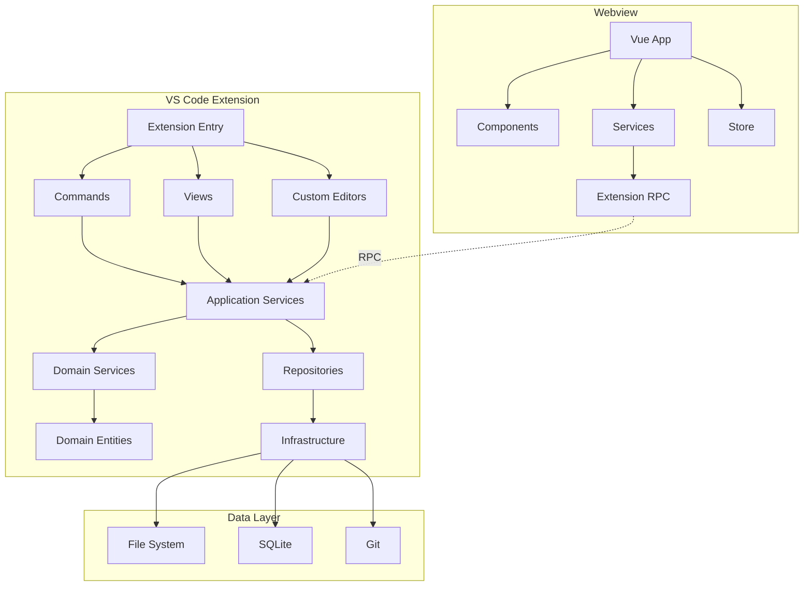

# ArchiTool

**ArchiTool** 是一个 VS Code 扩展，用于架构管理和知识库管理。它基于**知识伴随**（Knowledge Companion）的理念，让知识库与代码开发过程紧密结合，实现文档与代码的双向关联，帮助开发者在编码过程中随时查阅和更新架构知识。

## 💡 知识伴随理念

ArchiTool 遵循**知识伴随**的核心理念，让知识库成为开发过程中的自然组成部分：

- **代码与文档双向关联**：通过 `relatedCodePaths` 配置，文档可以关联到代码文件或目录，代码变更时可以快速定位相关文档
- **开发过程中的知识查阅**：在编写代码时，可以快速查看相关的架构文档、设计图和业务说明
- **知识库伴随代码演进**：文档和代码同步维护，知识库随项目发展而持续更新
- **多维度知识组织**：通过视点视图，从不同维度（类型、分类、标签）组织知识，便于快速定位
- **团队知识共享**：通过 Git Vault 实现知识库的版本控制和团队协作

## 📋 目录

- [知识伴随理念](#知识伴随理念)
- [功能特性](#功能特性)
- [快速开始](#快速开始)
- [项目结构](#项目结构)
- [技术架构](#技术架构)
- [开发指南](#开发指南)
- [相关文档](#相关文档)

## ✨ 功能特性

### 核心功能

1. **知识库管理**
   - 支持多个 Vault（知识库）
   - **Vault 类型**：
     - Document Vault - 文档知识库，用于存储架构文档和设计图
     - AI Enhancement Vault - AI增强和模板知识库，用于存储模板和AI增强功能
   - 支持本地 Vault 和 Git Vault
   - Git Vault 支持同步、更新和 Fork 操作
   - 文档、设计图、开发文档的统一管理

2. **设计图编辑**
   - **Mermaid 图表**：支持流程图、序列图、类图、甘特图等
   - **PlantUML 图表**：支持 UML 各种图表类型（类图、时序图、用例图等）
   - **Archimate 视图**：支持企业架构视图类型
   - 可视化编辑和实时预览
   - 自定义编辑器界面，提供代码编辑和预览双视图

3. **文档管理**
   - Markdown 文档支持
   - 文档分类和标签管理
   - 文档关联（文档间链接、代码关联）
   - 元数据编辑（Edit Metadata）
   - 路径操作（Copy Path, Copy Relative Path, Copy Name）
   - **代码关联配置**（`relatedCodePaths`，支持通配符匹配）
     - 实现文档与代码的双向关联
     - 在代码编辑器中快速查看关联文档
     - 支持通配符匹配（如 `src/auth/*` 匹配整个目录）

4. **视点视图**（知识伴随的核心功能）
   - 多维度查看架构文档
   - 按类型、分类、标签组织
   - **代码与文档的关联视图**：查看当前代码文件关联的所有文档和设计图
   - 在开发过程中快速定位相关知识
   - 支持按代码路径、文档类型、标签等维度筛选

5. **模板系统**
   - 结构模板（Structure Template）- 用于创建文档结构
   - 内容模板（Content Template）- 用于创建文档内容
   - 从模板创建文档/设计图

6. **Git Vault 支持**
   - 从 Git 仓库添加 Vault
   - 同步和更新功能
   - Fork Vault 功能

### VS Code 视图

扩展在 VS Code 侧边栏提供以下视图：

- **Documents**：文档和设计图管理
- **Tasks**：任务管理
- **Viewpoints**：视点视图（多维度查看）
- **Assistants**：模板和 AI 增强功能

## 🚀 快速开始

### 安装

1. 在 VS Code 中打开扩展市场
2. 搜索 "ArchiTool" 并安装
3. 扩展会在工作区根目录创建 `archidocs` 目录

### 基本使用

1. **创建 Vault**
   - 点击侧边栏 "Documents" 视图的 "+" 按钮
   - 选择 "Add Local Vault" 创建本地知识库
     - 选择 Vault 类型：Document Vault 或 AI Enhancement Vault
     - 输入 Vault 名称
   - 或选择 "Add Vault from Git" 从 Git 仓库导入
     - 输入 Git 仓库 URL
     - 配置远程端点信息

2. **添加文档**
   - 在 Vault 上右键，选择 "Add File" 创建 Markdown 文档
   - 或选择 "Add Mermaid Design" / "Add PlantUML Design" 创建设计图
   - 或选择 "Add Folder" 创建文件夹组织文档

3. **从模板创建**
   - 在创建文档或设计图时，可以选择使用模板
   - 结构模板：用于创建预定义的文档结构
   - 内容模板：用于创建包含模板内容的文档
   - 支持模板变量替换

4. **编辑设计图**
   - 双击 `.mmd` 文件打开 Mermaid 编辑器
   - 双击 `.puml` 文件打开 PlantUML 编辑器
   - 编辑器提供代码编辑和实时预览功能

5. **配置元数据和代码关联**（实现知识伴随的关键步骤）
   - 右键文档，选择 "Edit Metadata" 编辑元数据
   - 在元数据中配置 `relatedCodePaths` 关联代码路径
     - 示例：`["src/auth/*", "src/models/user.ts"]`
     - 支持通配符匹配（如 `src/auth/*` 匹配 `src/auth/login.ts`）
     - 支持多个路径配置，实现一个文档关联多个代码位置
   - 配置文档分类、标签等信息
   - **知识伴随效果**：配置后，在编辑关联的代码文件时，可以通过视点视图快速查看相关文档

6. **Git Vault 操作**
   - 右键 Git Vault，选择 "Sync Vault" 同步到远程
   - 选择 "Update from Remote" 从远程更新
   - 选择 "Fork Vault" 创建 Vault 副本

7. **路径操作**
   - 右键文档/文件夹，选择 "Copy Path" 复制完整路径
   - 选择 "Copy Relative Path" 复制相对路径
   - 选择 "Copy Name" 复制名称

### 知识伴随使用场景

**场景 1：开发新功能时查阅架构文档**
- 打开代码文件 `src/auth/login.ts`
- 在 Viewpoints 视图中自动显示关联的架构文档和设计图
- 快速了解业务背景、技术方案和设计决策

**场景 2：代码重构时更新文档**
- 修改代码后，通过代码关联快速定位相关文档
- 更新文档以反映代码变更
- 保持文档与代码的一致性

**场景 3：团队协作中的知识共享**
- 使用 Git Vault 同步团队知识库
- 新成员通过代码关联快速了解项目架构
- 知识库随代码演进持续更新

## 📁 项目结构

```
VSKnowledgebase/
├── extension/
│   ├── architool/          # VS Code 扩展主程序
│   │   ├── src/
│   │   │   ├── modules/
│   │   │   │   ├── document/   # 文档管理模块
│   │   │   │   ├── editor/     # 编辑器模块（Mermaid/PlantUML）
│   │   │   │   ├── template/   # 模板管理模块
│   │   │   │   ├── task/       # 任务管理模块
│   │   │   │   └── shared/     # 共享业务逻辑
│   │   │   ├── commands/       # 命令实现
│   │   │   ├── views/          # 视图实现
│   │   │   └── extension.ts   # 扩展入口
│   │   └── package.json
│   └── architool-intellij/ # IntelliJ IDEA 插件（开发中）
├── packages/
│   ├── webview/            # Webview 前端（Vue 3 + Element Plus）
│   └── vault-assistant/    # 模板和 AI 增强功能包
└── README.md               # 本文档
```

### 关键目录说明

- **`archidocs/`**：工作区根目录下的配置和数据目录
  - 每个 Vault 一个子目录
  - 包含 artifacts、metadata、templates 等

- **`extension/architool/src/modules/`**：核心业务模块
  - `document/` - 文档管理模块
  - `editor/` - 编辑器模块（Mermaid/PlantUML）
  - `template/` - 模板管理模块
  - `task/` - 任务管理模块
  - `shared/` - 共享业务逻辑（Vault、Artifact、文件操作等）

- **`packages/webview/`**：Webview 前端
  - Vue 3 + Element Plus + Pinia
  - 支持多视图（Viewpoints、编辑器等）

- **`packages/vault-assistant/`**：模板和 AI 增强功能
  - `archi-templates/` - 模板内容
  - `archi-ai-enhancements/` - AI 增强命令

## 🏗️ 技术架构

### 技术栈

- **前端（Webview）**：
  - Vue 3 - 渐进式 JavaScript 框架
  - Element Plus - Vue 3 组件库
  - Pinia - 状态管理
  - Mermaid - 图表渲染
  - CodeMirror - 代码编辑器
  - Vite - 构建工具

- **后端（扩展）**：
  - TypeScript - 类型安全的 JavaScript
  - Node.js - 运行时环境
  - Inversify - 依赖注入容器
  - Webpack - 模块打包工具

- **架构设计**：
  - DDD（领域驱动设计）- 分层架构
    - Application Layer - 应用服务层
    - Domain Layer - 领域模型层
    - Infrastructure Layer - 基础设施层
    - Interface Layer - 接口层（命令、视图等）

- **数据存储**：
  - SQLite - 元数据和索引存储（支持快速查询代码关联）
  - 文件系统 - 文档和设计图存储
  - YAML - 元数据配置文件（存储代码关联信息）

- **知识伴随实现**：
  - 代码关联索引：通过 SQLite 存储代码路径与文档的关联关系
  - 实时查询：在代码编辑器中快速查询关联文档
  - 双向关联：支持从代码查看文档，从文档查看关联代码
  - 通配符匹配：支持目录级别的代码关联，提高关联效率

### 架构图



## 🛠️ 开发指南

### 环境要求

- Node.js >= 18.0.0
- VS Code >= 1.80.0
- pnpm（推荐）或 npm

### 快速开始

**在项目根目录执行**：

```bash
# 1. 安装依赖
pnpm install

# 2. 重新编译 better-sqlite3（为 Electron 环境）
cd extension/architool && pnpm run rebuild:electron && cd ../..
```

### 开发工作流

#### 开发模式

**在项目根目录执行**：

```bash
# 监听模式（自动编译）
pnpm run watch
```

在 VS Code 中按 `F5` 启动调试。

#### 构建项目

**在项目根目录执行**：

```bash
# 构建所有模块（编译 TypeScript、构建子包等）
pnpm run build

# 只构建扩展
pnpm run build:extension

# 只构建 webview
pnpm run build:webview
```

**构建流程说明**：
1. `build:webview` - 构建 Webview 前端（Vue 3 + Vite）
2. `build:extension` - 编译扩展 TypeScript 代码（Webpack）
3. `copy:vendor` - 复制 PlantUML JAR 文件到扩展目录

**注意**：`build` 命令只构建项目，**不会生成 `.vsix` 文件**。要生成 `.vsix` 文件，请使用 [打包发布](#打包发布) 章节中的 `package` 命令。

#### 运行测试

**在项目根目录执行**：

```bash
# 运行所有测试
pnpm test
```

### 打包发布

将扩展打包为 `.vsix` 文件，用于发布或本地安装。

**重要**：`pnpm run build` 只构建项目，**不会生成 `.vsix` 文件**。要生成 `.vsix` 文件，必须使用下面的 `package` 命令。

#### 打包命令

**在项目根目录执行**：

```bash
# 完整打包（推荐）：构建 + 重新编译 native 模块 + 打包生成 .vsix
pnpm run package

# 快速打包：仅打包（跳过构建和重新编译）
pnpm run package:quick
```

**打包流程**：
1. 构建所有子包（webview）
2. 编译 TypeScript 代码
3. 复制 PlantUML 等 vendor 文件
4. 使用 `vsce` 打包生成 `.vsix` 文件

**输出位置**：`extension/architool/architool-{version}.vsix`

#### 安装测试

**方式 1：命令行安装（在项目根目录执行）**
```bash
code --install-extension extension/architool/architool-0.1.0.vsix
```

**方式 2：VS Code GUI**
1. 打开扩展视图（`Ctrl+Shift+X` / `Cmd+Shift+X`）
2. 点击 "..." 菜单 → "Install from VSIX..."
3. 选择 `extension/architool/architool-{version}.vsix`

#### 打包前检查

- ✅ 检查 `extension/architool/package.json` 中的 `version` 字段
- ✅ 确认 `publisher` 字段（当前为 `"architool"`）
- ✅ 确保已执行 `pnpm install`

**注意事项**：
- ⚠️ 生成的 `.vsix` 文件可能较大（包含所有依赖和构建产物）
- ⚠️ 打包前确保已执行 `pnpm install` 安装所有依赖

### 代码规范

**在项目根目录执行**：

```bash
# 格式化代码
pnpm run format

# 代码检查
pnpm run lint

# 类型检查
pnpm run typecheck
```

## 📚 相关文档

- [IDE 适配器架构文档](./IDE_ADAPTER_ARCHITECTURE.md) - IDE 适配器架构设计

## 🔮 未来计划

### 功能增强

- [ ] 完善 IntelliJ IDEA 插件支持
- [ ] 增强模板系统功能
- [ ] 优化文档搜索和索引性能
- [ ] 支持更多图表类型和编辑器功能
- [ ] 改进代码关联和文档同步机制

## 📝 许可证

本项目采用 [MIT 许可证](LICENSE)。

## 👥 贡献

欢迎提交 Issue 和 Pull Request！

## 📧 联系方式

- GitHub: [VSKnowledgebase](https://github.com/ai-archi/VSKnowledgebase)

---

**文档版本**：v2.0  
**最后更新**：2025-01-XX  
**维护者**：ArchiTool Team

